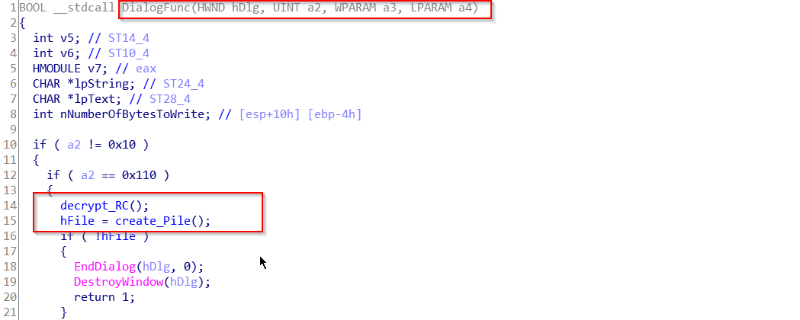
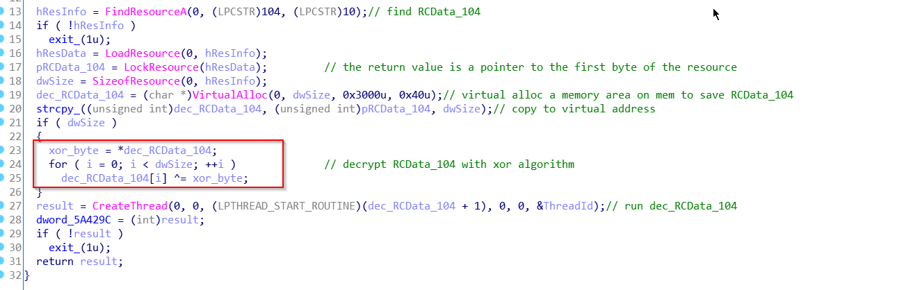
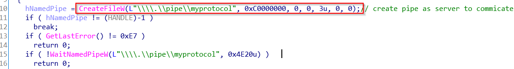
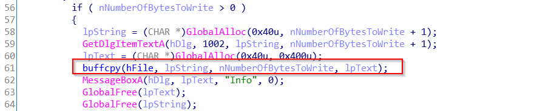
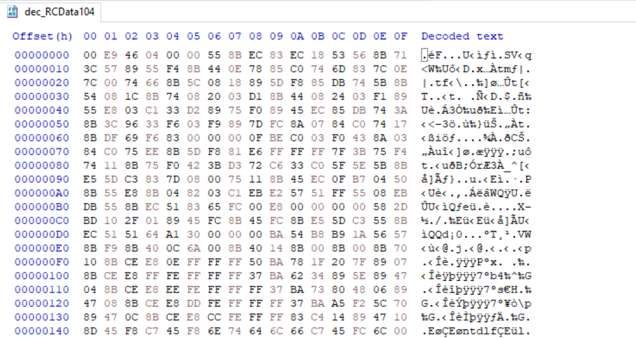
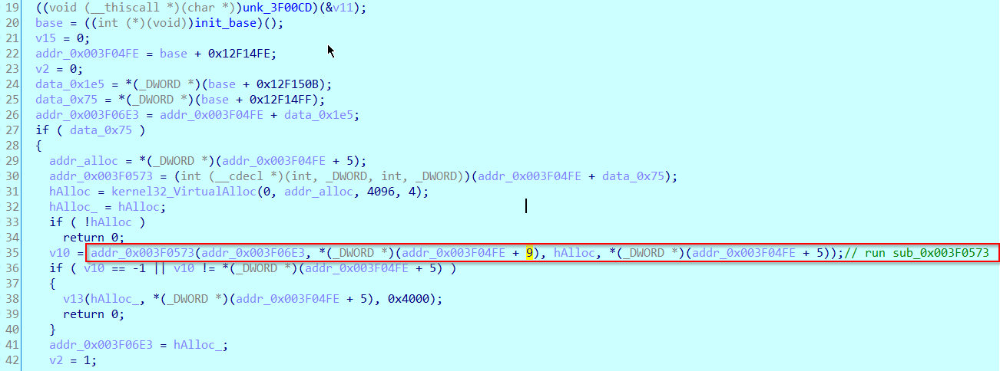
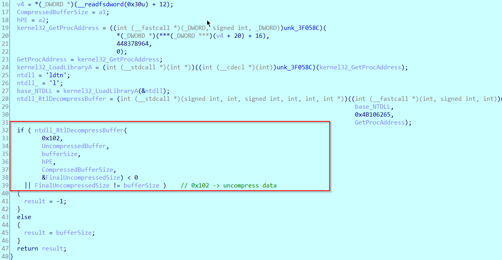
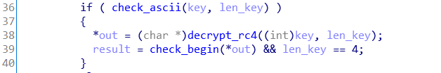
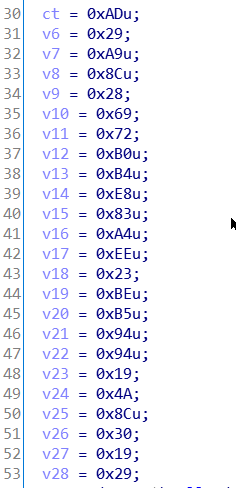
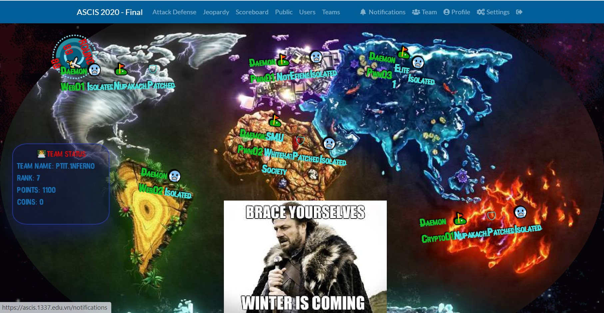

<<<<<<< HEAD:2022/1_SVATTT20/Namep/README.md
# Writeup RE-Namep

## Description

 `simple RE, simple GUI, ... everything is simple`

Given File: ` Namep.exe`

## Analysis

#### Phân tích xung quanh file:

1. Check file bằng `cff explorer` --> đây là file PE 32 bit
2. Check rc bằng `resource hacker` --> thấy resource `RCData_104` không ổn lắm
3. Load file vào IDA  

#### Phân tích file exe:

Trong  hàm `DialogFunc` bắt đầu bằng hàm `decrypt_RC()` và sau đó là `create_Pipe`

Hàm `decrypt_RC()` lấy  load resource sau đó `xor` các byte với giá trị của byte số 0 trong RC

Hàm `create_Pipe()` tạo ra một `pipe` để giao tiếp giữa client và server 

Sau khi khởi tạo window, chương trình sẽ đọc data từ pipe và set giá trị cho `MessageBox` 

Run chương trình --> nhận input --> print `msgbox`  `Noob~` (khi input chưa đúng)

Kết luận 1: file exe giống như một `loader`,  nhận input --> đẩy sang cho server xử lý --> nhận và hiện ra kết quả trả về từ server

#### Phân tích Resource:

`Resource Hacker` cho phép ta extract resource trong file exe, sau đó viết script python đơn giản để `decrypt_RC` 

```python
rc = open("RCData104", "rb").read()
tmp = rc[0]
out = []
for i in range(len(rc)):
    out.append(tmp ^ rc[i])

open("dec_RCData104", "wb").write(bytearray(out))
print ("done")
```

 view decrypt file bằng `hex_editor`  --> khả năng là `shellcode`

Viết script đơn giản để load được shellcode

```c
#include <Windows.h>
#include <stdio.h>
BYTE shellcode[] = {};
int main() {
    int shellcodeSize = sizeof(shellcode);
    void* exec = VirtualAlloc(0, shellcodeSize, MEM_COMMIT, PAGE_EXECUTE_READWRITE);
    memcpy(exec, shellcode, shellcodeSize);
    ((void(*)())exec)();

    return 0;
}
```

#### Phân tích Shellcode:

Shellcode sẽ tính base của dll --> sau đó gọi hàm bằng cách cộng ofs 

Trong hàm `sub_0x003F573` --> gọi đến hàm `sub_3F0643`, hàm này sẽ get địa chỉ đến hàm `ntdll_RtlDecompressBuffer` sau đó decrypt data trong shellcode 1 lần nữa. 

Cho chương trình thực hiện xong hàm `Decompress` , ta có địa chỉ buffer + sizebuffer -> viết IDAscript để extract data lượt 2

```python
import idautils
import idaapi

ea = {addr_buffer}
size = {size_buffer}
data = idc.GetManyBytes(ea, size)
with open("dumped.bin", "wb") as fp:
    fp.write(data)
print ("Done!")
```

#### Phân tích file `dumped`

Load file dump được vào IDA, nhận thấy có hàm `DllMain` => file dump được là một file dll, luồng thực thi:

1. tạo pipe để giao tiếp với client (là file exe)
2. nhận input từ file exe -> đưa vào hàm check
3. trả về kết quả cho file exe hiển thị

Phân tích hàm check:



key RC4 có len = 4, ciphertext đã có là: 

hàm  `check_begin` là kiểm tra xem output có bắt đầu bằng `ASCI` hay không. 

key trong khoảng (32; 128), nếu bruteforce thì sẽ là 96**4 ( hơi lâu nhưng có khả thi)

kết quả : key = `Viet`  flag = `ASCIS{4_s1mpl3_pr0toco1}`  (T_T trong phòng thi mình brute khá là ngu)

Ngoài lề: submit bài này vào lúc 15:30, team mình thấy cũng không có hope gì nữa, mà bài web01 và crypto01 vừa attack được lại bị MSEC ném băng nên ae quyết định lấy coin bài re đóng băng toàn bộ server, trao yêu thương đến các team còn lại =)))). Mong các team bạn còn ấn tượng về NUPAKACHI

<ảnh lum từ team khác>
=======
# Writeup RE-Namep

## Description

 `simple RE, simple GUI, ... everything is simple`

Given File: ` Namep.exe`

## Analysis

#### Phân tích xung quanh file:

1. Check file bằng `cff explorer` --> đây là file PE 32 bit
2. Check rc bằng `resource hacker` --> thấy resource `RCData_104` không ổn lắm
3. Load file vào IDA  

#### Phân tích file exe:

Trong  hàm `DialogFunc` bắt đầu bằng hàm `decrypt_RC()` và sau đó là `create_Pipe`

Hàm `decrypt_RC()` lấy  load resource sau đó `xor` các byte với giá trị của byte số 0 trong RC

Hàm `create_Pipe()` tạo ra một `pipe` để giao tiếp giữa client và server 

Sau khi khởi tạo window, chương trình sẽ đọc data từ pipe và set giá trị cho `MessageBox` 

Run chương trình --> nhận input --> print `msgbox`  `Noob~` (khi input chưa đúng)

Kết luận 1: file exe giống như một `loader`,  nhận input --> đẩy sang cho server xử lý --> nhận và hiện ra kết quả trả về từ server

#### Phân tích Resource:

`Resource Hacker` cho phép ta extract resource trong file exe, sau đó viết script python đơn giản để `decrypt_RC` 

```python
rc = open("RCData104", "rb").read()
tmp = rc[0]
out = []
for i in range(len(rc)):
    out.append(tmp ^ rc[i])

open("dec_RCData104", "wb").write(bytearray(out))
print ("done")
```

 view decrypt file bằng `hex_editor`  --> khả năng là `shellcode`

Viết script đơn giản để load được shellcode

```c
#include <Windows.h>
#include <stdio.h>
BYTE shellcode[] = {};
int main() {
    int shellcodeSize = sizeof(shellcode);
    void* exec = VirtualAlloc(0, shellcodeSize, MEM_COMMIT, PAGE_EXECUTE_READWRITE);
    memcpy(exec, shellcode, shellcodeSize);
    ((void(*)())exec)();

    return 0;
}
```

#### Phân tích Shellcode:

Shellcode sẽ tính base của dll --> sau đó gọi hàm bằng cách cộng ofs 

Trong hàm `sub_0x003F573` --> gọi đến hàm `sub_3F0643`, hàm này sẽ get địa chỉ đến hàm `ntdll_RtlDecompressBuffer` sau đó decrypt data trong shellcode 1 lần nữa. 

Cho chương trình thực hiện xong hàm `Decompress` , ta có địa chỉ buffer + sizebuffer -> viết IDAscript để extract data lượt 2

```python
import idautils
import idaapi

ea = {addr_buffer}
size = {size_buffer}
data = idc.GetManyBytes(ea, size)
with open("dumped.bin", "wb") as fp:
    fp.write(data)
print ("Done!")
```

#### Phân tích file `dumped`

Load file dump được vào IDA, nhận thấy có hàm `DllMain` => file dump được là một file dll, luồng thực thi:

1. tạo pipe để giao tiếp với client (là file exe)
2. nhận input từ file exe -> đưa vào hàm check
3. trả về kết quả cho file exe hiển thị

Phân tích hàm check:


key RC4 có len = 4, ciphertext đã có là: 

hàm  `check_begin` là kiểm tra xem output có bắt đầu bằng `ASCI` hay không. 

key trong khoảng (32; 128), nếu bruteforce thì sẽ là 96**4 ( hơi lâu nhưng có khả thi)

kết quả : key = `Viet`  flag = `ASCIS{4_s1mpl3_pr0toco1}`  (T_T trong phòng thi mình brute khá là ngu)

Ngoài lề: submit bài này vào lúc 15:30, team mình thấy cũng không có hope gì nữa, mà bài web01 và crypto01 vừa attack được lại bị MSEC ném băng nên ae quyết định lấy coin bài re đóng băng toàn bộ server, trao yêu thương đến các team còn lại =)))). Mong các team bạn còn ấn tượng về NUPAKACHI

<ảnh lum từ team khác>
>>>>>>> 7ecbfe18d299a69dc9a64d115d6606d93a5892a8:1_SVATTT20/Namep/README.md
