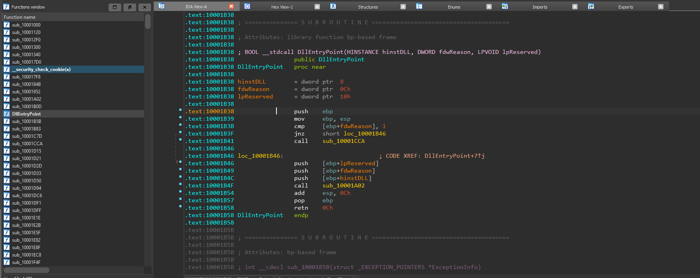

# Matryoshka-Doll

### Description


### Solution

Chall này mình lấy ý tưởng từ bài [Namep](https://github.com/lanleft/CTF_Writeups/tree/master/1_SVATTT20/Namep) của **ASCIS** final năm 2020

### Flow

`Code DLL` --> chuyển qua `shellcode` (mình dùng tool [này](https://github.com/hasherezade/pe_to_shellcode))

 --> import vào phần `resource`--> code một chương trình `loader` để load resource trên

### Phân tích source code

#### Load Resource

Một chương trình đơn giản load shellcode từ resource

```C
#include <iostream>
#include <Windows.h>
#include "resource.h"

#include <shlwapi.h>
#include <TlHelp32.h>

int main()
{
	// load resource
	HRSRC shellcodeResource = FindResource(NULL, MAKEINTRESOURCE(IDR_BIN011), L"bin01");
	DWORD shellcodeSize = SizeofResource(NULL, shellcodeResource);
	HGLOBAL shellcodeResourceData = LoadResource(NULL, shellcodeResource);

	// run shellcode
	void* exec = VirtualAlloc(0, shellcodeSize, MEM_COMMIT, PAGE_EXECUTE_READWRITE);
	memcpy(exec, shellcodeResourceData, shellcodeSize);

	((void(*)())exec)();

	return 0;

}
```

#### Obfuscate

Mình dùng một opensource là *XorStr*

```C
puts(xorstr("Input your flag: ").crypt_get());
scanf("%64s", &pt);

if (strlen((char*)pt) != 64) {
    puts(xorstr("Wrong length of flag...\n").crypt_get());
    return 0;
}
```

#### Crypto

Mình sử dụng thuật toán mã hóa AES với source code từ *tiny-AES-c*

```C
AES_init_ctx_iv(&ctx, key, iv);
AES_CBC_encrypt_buffer(&ctx, pt, 64);

```

### Phân tích Binary

#### 1. Dump file dll

Mình làm hoàn toàn giống challenge **Namep** để có được file **DLL**

#### 2. Xác định hàm bắt đầu trong file DLL

Mình để ý rằng, các **file** khi được **compile** bằng *visual studio* ở mode **release** sẽ bị *optimize* rất là nhiều cộng thêm *strip* làm cho file *binary* rất khó để reverse (*obfuscate* nhiều vlu :v) 

Chương trình mình code, mà khi reverse mãi mình mới tìm được `main` luôn :<

Nhưng mình nhận ra, sẽ có một đường đi chung (của các file được compile ở mode *release* ) để đến được hàm `main` (xử lý chính của chương trình mà mình cần tìm). Và nó sẽ đi như sau:

Đầu tiên, mình sẽ đi đến `DllEntryPoint` của file dll này:



IDA thường sẽ tìm được `DllEntryPoint` các các file dll

còn tiếp...
