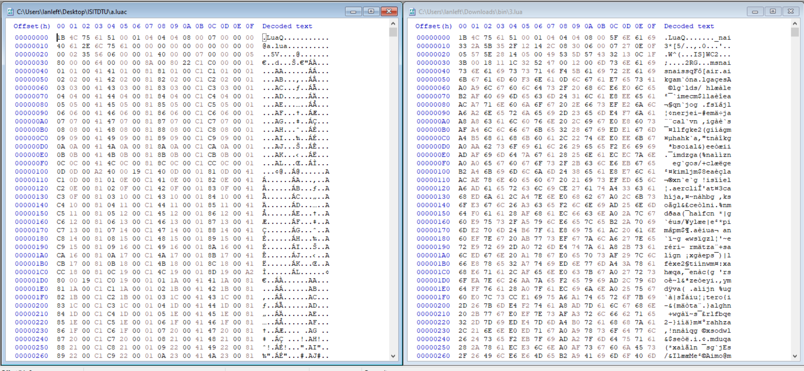
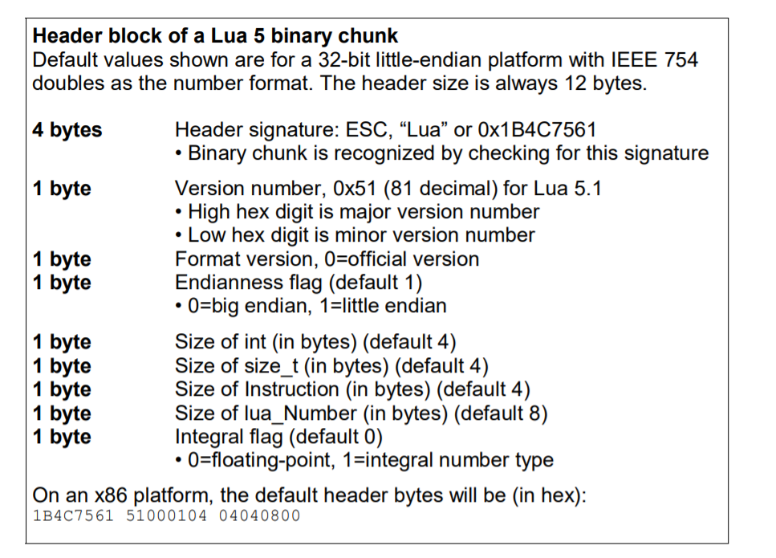
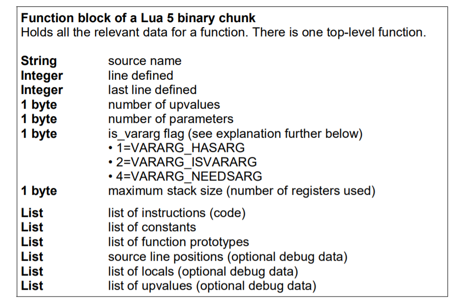

# LoveSea

=))) tí thì feed giải

Mình không biết giải thích như thế nào để mọi người dễ hiểu nhất, vậy nên mình sẽ viết tất cả những bước mình làm từ lúc download challenge về đến khi ra được script lua cuối cùng nhé.

Đầu tiên, mình đọc được miêu tả của challenge là phải cài game 22GB, và có thêm 1 plugin của tác giải tự code. Plugin sau khi extract như sau:

```
res 
	auto
		3.lua
	lua.package
	skin.package
```

Mình nhận ra những file package là những file có trước của game (chắc thêm vào để load màu các thứ, maybe vì mình chưa run cái plugin này lần nào). (mình check md5sum nhé)

Mình tiếp tục coi đến file 3.lua

```
00000000: 1b4c 7561 5100 0104 0404 0800 5f6e 6169  .LuaQ......._nai
00000010: 332a 5b35 2f12 142c 0830 0600 0727 0e0f  3*[5/..,.0...'..
00000020: 0557 5e28 1405 0049 535d 5743 3213 0c1f  .W^(...IS]WC2...
00000030: 3b00 1811 1c32 5247 0012 006d 736e 6169  ;....2RG...msnai
00000040: 736e 6169 7373 7146 f45b 6169 722e 6169  snaissqF.[air.ai
00000050: 6b67 616d 60f3 6e61 0d6c 6761 e765 7341  kgam`.na.lga.esA
00000060: a0a9 6c67 606c 6473 2f20 686c e6e0 6c65  ..lg`lds/ hl..le
```

Mình thấy header đúng là các bytecode của lua, nhưng khi mình thử decompile (= luadec) thì nó bị lỗi `3.lua: bad header in precompiled chunk`

Lúc này mình nghĩ đến khả năng file lua này bị custom opcode, để chắc chắn hơn thì mình tự compile 1 file lua bằng lua-5.1 để so sánh  bytecodes (mình lấy luôn file a.lua từ challenge warmup).



=> chắc chắn bytecode của 3.lua bị encode rồi 

Nhưng plugin mà mình tải về chỉ có 1 file lua này thôi => file encode nằm trong folder của của game CuuAmChankinh.

Mình đi đến folder của game, và grep tất cả những string mà mình nghĩ sẽ liên quan đến encode ví dụ như: encode, decode, encrypt, decrypt, .lua,... và check các file có matching. Mất một lúc không tìm được điều gì thì mình đọc lại file `3.lua`, kéo xuống gần cuối mình càng nhìn thấy càng nhiều chữ `snail`, `lgam`, `gme` 

```
0002a260: 736f 6169 6c66 616d 6572 6e61 696d 6761  soailfamernaimga
0002a270: 6d64 736e 6168 6c67 616c 6573 6e60 696c  mdsnahlgalesn`il
0002a280: 6760 6d65 736f 6169 6c66 616d 6572 6e61  g`mesoailfamerna
0002a290: 696d 6761 6d64 736e 6168 6c67 616c 6573  imgamdsnahlgales
0002a2a0: 6e60 696c 6760 6d65 736f 6169 6c66 616d  n`ilg`mesoailfam
0002a2b0: 6572 6e61 696d 6761 6d64 736e 6168 6c67  ernaimgamdsnahlg
0002a2c0: 616c 6573 6e60 696c 6760 6d65 736f 6169  alesn`ilg`mesoai
0002a2d0: 6c66 616d 6572 6e61 696d 6761 6d64 736e  lfamernaimgamdsn
0002a2e0: 6168 6c67 616c 6573 6e60 696c 6760 6d65  ahlgalesn`ilg`me
0002a2f0: 736f 6169 6c66 616d 6572 6e61 696d 6761  soailfamernaimga
0002a300: 6d64 736e 6168 6c67 616c 6573 6e60 696c  mdsnahlgalesn`il
```

 Thế là mình grep theo string `snail`

```
Binary file bugreport.exe matches
Binary file fxcore.dll matches
Binary file fxgamelogic.dll matches
Binary file fxmovie.dll matches
Binary file spdc.dll matches
```

Chỉ có 1 số file nên cũng đơn giản, mình đi vào từ file và tìm grep theo `snail` -> cuối cùng mình tìm được file `fxcore.dll` là có những hàm xor bytecode với string `snailgame`

```C
  if ( Size )
  {
    v6 = v5;
    idx = a2 - (_DWORD)v5;
    do
    {
      if ( a4 )
        *v6 = v6[idx] ^ aSnailgame[idx2 % 9];
      else
        *v6 = v6[idx];
      ++idx2;
      ++v6;
    }
    while ( idx2 < Size );
  }
```

Nếu tất cả bytecode đều xor lần lượt với `snailgame` thì mọi thứ khá là đơn giản nhưng rất buồn là sau khi xem qua file dll mình không phải vậy (dm lua :<). Mình đã quyết định đọc xem file dll này parse bytecode như thế nào.

Mình vừa đọc dll vừa map với paper của lua [file này](files/ANoFrillsIntroToLua51VMInstructions.pdf)

Sau khi xref một vài lần, mình tìm được đến hàm bắt đầu của decode

```c
int __cdecl sub_10008C50(int a1, A1 *a2, int a3, int a4, int a5)
{
/// ...
  encode_header(v6);
  encode_bodylua(a2, 0, v6);
  return v7;
}
```

Parse phần header



```c
size_t __thiscall sub_10008C10(int *this)
{
    //
  asign_12bytes((A1 *));
    //
}
int __cdecl asign_12bytes(A1 *lua_bytecode)
{
  lua_bytecode->signature_lua = 0x61754C1B;     // header signature
  lua_bytecode->field_4 = 0x4010051;            // version + endianess flag + size of int + size of size_t
  lua_bytecode->field_8 = 0x80404;              // lua_number + integral flag
  return &lua_bytecode->field_8 + 2;
}
```

12 bytes đầu là signature của lua và được gán trực tiếp.

Tiếp đến phần body



```c
size_t __cdecl encode_bodylua(A1 *lua_bytecode, int a2, int *a3)
{
  int v3; // eax

  v3 = lua_bytecode->field_20;
  if ( v3 == a2 || a3[3] )
    v3 = 0;
  enc_get_filename(v3, a3);
  enc_get_line(a3, lua_bytecode->field_3C);     // source name
  enc_get_line(a3, lua_bytecode->field_40);     // line_defined 
  enc_get_bytes(a3, lua_bytecode->field_48);    // last line defined
  enc_get_bytes(a3, lua_bytecode->field_49);    // number of upvalues
  enc_get_bytes(a3, lua_bytecode->field_4A);    // number of parameters
  enc_get_bytes(a3, lua_bytecode->field_4B);    // maximum stack size 
  enc_ins(a3, lua_bytecode->field_2C, lua_bytecode->field_C, 4);// list of instructions
  enc_const(a3, lua_bytecode);                  // list of constants
  return enc_tpy(a3, &lua_bytecode->signature_lua);// funtion prototypes + source line positions + locals + upvalues
}
```

Đi vào từng hàm nhỏ, đầu tiên từ hàm `enc_get_filename`

```c
size_t __usercall get_filename@<eax>(int a1@<eax>, int *a2@<ecx>)
{
// ...
    v5 = *(a1 + 12) + 1;
    enc_data_with_size(4u, 1, a2, &v5);         // get size of filename
    return enc_data_with_size(v5, 1, a2, v3);   // get string file name
  }
}
```

Hàm này sẽ encode 4 bytes là size của filename (từ offset 0xc), sau đó encode cả filename

Đi vào hàm `enc_data_with_size`

```c
size_t __usercall enc_data_with_size@<eax>(size_t size_enc@<eax>, int a2@<edx>, int *a3@<esi>, int a4)
{
//
    v4 = encode_snailgame(*a3, a4, size_enc, a2);
//
}
void *__cdecl encode_snailgame(int lua_bytecode, int a2, size_t Size, int a4)
{
//
  if ( dword_10091020 >= Size )
  {
    v5 = Block;
  }
  else
  {
    if ( Block )
      free(Block);
    v5 = malloc(Size);
    Block = v5;
    dword_10091020 = Size;
  }
  if ( Size )
  {
    v6 = v5;
    idx = a2 - v5;
    do
    {
      if ( a4 )
        *v6 = v6[idx] ^ aSnailgame[idx2 % 9];
      else
        *v6 = v6[idx];
      ++idx2;
      ++v6;
    }
    while ( idx2 < Size );
  }
  return v5;
}
```

Gọi đến hàm `enc_snailgame`, hàm này sẽ malloc thêm 1 vùng nhớ với size truyền vào từ hàm trên và encode xor với string `snailgame`

Đi tiếp từ cái `enc_body`, sau khi encode size và string của filename thì chương trình encode tiếp các line 

```c
size_t __usercall enc_get_line@<eax>(int *a1@<esi>, ...)
{
//
  return enc_data_with_size(4u, 1, a1, va);
}
```

Các line có size là 4 -> encode 4 bytes

Sau đó là hàm `enc_get_bytes`

```c
size_t __usercall enc_get_bytes@<eax>(int *a1@<esi>, ...)
{
//
  return enc_data_with_size(1u, 1, a1, va);
}
```

Các byte có size là 1 -> encode 1 bytes

Tiếp theo là hàm encode instructions

```c
size_t __usercall enc_ins@<eax>(int *a1@<eax>, int a2@<edi>, int a3, int value_4)
{
  enc_get_line(a1);
  return enc_data_with_size(value_4 * a2, 1, a1, a3);
}
```

`enc_get_line` encode 4 bytes đầu (chính là số các line), và sau đó encode 1 block với size là (giá trị của 4 byte trên * 4)

Tiếp nữa là hàm encode constants

```c
size_t __usercall enc_const@<eax>(int *a1@<eax>, A1 *a2)
{
//
  enc_get_line(a1, v3);
  if ( v3 > 0 )
  {
    block = 0;
    v11 = v3;
    do
    {
      v5 = a2->field_8;
      v6 = *(v5 + block + 8);
      v7 = (block + v5);
      enc_get_bytes(a1, v6);
      switch ( v7[2] )
      {
        case 1:
          enc_get_bytes(a1, *v7);
          break;
        case 3:
          enc_get_double(a1, *v7);
          break;
        case 4:
          enc_get_filename(*v7, a1);
          break;
      }
      block += 16;
      --v11;
    }
    while ( v11 );
  }
  v8 = *&a2->gap30[4];
  result = enc_get_line(a1, v8);
  for ( i = 0; i < v8; ++i )
    result = encode_bodylua(*(*a2->gap10 + 4 * i), a2->field_20, a1);
  return result;
}
```

Đầu tiên, chương trình lấy 4 bytes đầu tiên để biết số các constants trong file.

Tiếp đó, lấy 1 bytes để biết xem constant đó là loại nào, trong hàm trên có 3 loại constants:

1 -> byte, 3 -> double, 4 -> string

Với mỗi type khác nhau, chương trình sẽ encode với mỗi size khác nhau. Ví dụ nếu là byte thì chương trình encode 1 bytes, double là 8 bytes, còn string thì chương trình sẽ encode 4 bytes size trước và sau đó là encode n bytes size của string.

Sau khi kết thúc các constants, chương trình encode 4 bytes tiếp và gọi n lần (chính là giá trị 4 bytes vừa đọc được) hàm `enc_body` (mình đoán là các hàm nhỏ hơn có cùng struct nên chương trình encode như vậy).

Cuối cùng là hàm encode funtion prototypes + source line positions + locals + upvalues

```c
size_t __usercall enc_tpy@<eax>(int *a1@<eax>, int *a2@<ebx>)
{
//
  if ( a1[3] )
    v3 = 0;
  else
    v3 = a2[12];
  enc_ins(a1, v3, a2[5], 4);
  if ( a1[3] )
    v4 = 0;
  else
    v4 = a2[14];
  enc_get_line(a1, v4);
  if ( v4 > 0 )
  {
    v5 = 0;
    do
    {
      enc_get_filename(*(a2[6] + v5), a1);
      enc_get_line(a1, *(a2[6] + v5 + 4));
      enc_get_line(a1, *(a2[6] + v5 + 8));
      v5 += 12;
      --v4;
    }
    while ( v4 );
  }
  if ( a1[3] )
    v6 = 0;
  else
    v6 = a2[9];
  result = enc_get_line(a1, v6);
  for ( i = 0; i < v6; ++i )
    result = enc_get_filename(*(a2[7] + 4 * i), a1);
  return result;
}
```

 Phù, mệt vler :<. Hàm này cũng encode kiểu kiểu như trên nhé, đến đoạn này mình cũng lười đọc document rồi nên viết script decode luôn.
Script decode mình đi theo các hàm mình vừa parse được và thêm một đoạn xor với string `snailgame` 

Sau đó mình dùng `luadec` để decompile file bytecode này. Nhưng vẫn bị lỗi `./luadec64: 3.lua: bad header in precompiled chunk`

Mình đọc đi đọc lại cái dll và script xem có sai ở đâu không và khá chắc là nó đúng. Tìm một hồi thì mình nhận ra các file dll đều là 32bit , xong mình nghĩ có khi nào do khác arch nên không decompile được không?

Compile lại `luadec` ở 32bit thì done =)))). (cơ mà vẫn dm lua :<)

```lua
-- Decompiled using luadec 2.2 rev: 895d923 for Lua 5.1 from https://github.com/viruscamp/luadec
-- Command line: dec.lua

-- params : ...
-- function num : 0
key = "Good Job"
local a = loadstring((function(b, c)
  -- function num : 0_0
  bxor = function(d, e)
    -- function num : 0_0_0
    local f = {
{0, 1}
,
{1, 0}
}
    local g = 1
    local h = 0
    while 1 do
      if d > 0 or e > 0 then
        h = h + (f[d % 2 + 1])[e % 2 + 1] * g
        d = (math.floor)(d / 2)
        e = (math.floor)(e / 2)
        g = g * 2
        -- DECOMPILER ERROR at PC35: LeaveBlock: unexpected jumping out IF_THEN_STMT

        -- DECOMPILER ERROR at PC35: LeaveBlock: unexpected jumping out IF_STMT

      end
    end
    return h
  end

  local i = function(b)
    -- function num : 0_0_1
    local j = {}
    local k = 1
    local l = b[k]
    while l >= 0 do
      j[k] = b[l + 1]
      k = k + 1
      l = b[k]
    end
    return j
  end

  local m = function(b, c)
    -- function num : 0_0_2
    if #c <= 0 then
      return {}
    end
    local k = 1
    local n = 1
    for k = 1, #b do
      b[k] = bxor(b[k], (string.byte)(c, n))
      n = n + 1
      if #c < n then
        n = 1
      end
    end
    return b
  end

  local o = function(b)
    -- function num : 0_0_3
    local j = ""
    for k = 1, #b do
      j = j .. (string.char)(b[k])
    end
    return j
  end

  return o(m(i(b), c))
end
)({7715, 12725, 10301, 9158, 7197, 7204, 12716, 12592, 8575, 13005, 11314, 11184, 10904, 12334, 9091, 7695, 10512, 12039, 8032, 7399, 10191, 7570, 9221, 10907, 7586, 10286, 7041, 9925, 8333, 11551, 7458....,43, 68, 89, 67, 7, 100, 124, 0, 0, 29, 102, 79, 40, 23, 79, 82}, key))
if a then
  a()
else
  print("WRONG PASSWORD!")
end
```


