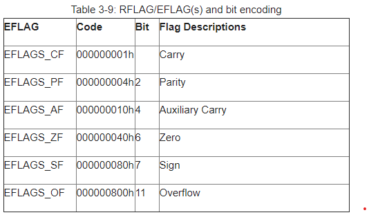

# Nanomites

Miêu tả:

Find the password that validates this binary.

[nanomites](files/ch29.bin)

### Part1:

Data ở addr `400C60` được `xor` với `0x42` , sau khi xor lại thì mình được một đoạn asm sau:

```asm
.rodata:0000000000400C60 48 31 C9                              xor     rcx, rcx
.rodata:0000000000400C63 48 8B 07                              mov     rax, [rdi]
.rodata:0000000000400C66 48 83 C7 08                           add     rdi, 8
.rodata:0000000000400C6A 48 BB 42 79 59 49+                    mov     rbx, 7FFF427749597942h
.rodata:0000000000400C6A 77 42 FF 7F
.rodata:0000000000400C74 48 31 D8                              xor     rax, rbx
.rodata:0000000000400C77 48 A1 EF BE AD DE+                    mov     rax, ds:0DEADBEEFh
.rodata:0000000000400C77 00 00 00 00
.rodata:0000000000400C81 48 39 C8                              cmp     rax, rcx
.rodata:0000000000400C84 CC                                    int     3               ; Trap to Debugger
.rodata:0000000000400C85 90                                    nop
.rodata:0000000000400C86 CC                                    int     3               ; Trap to Debugger
.rodata:0000000000400C87 90                                    nop
.rodata:0000000000400C88 48 A1 EF BE AD DE+                    mov     rax, ds:0DEADBEEFh
...
.rodata:0000000000400CE3 48 31 C0                              xor     rax, rax
.rodata:0000000000400CE6 FE C0                                 inc     al
.rodata:0000000000400CE8 BF 01 00 00 00                        mov     edi, 1
.rodata:0000000000400CED 48 BE 50 0C 40 00+                    mov     rsi, offset aWrong ; "Wrong."
.rodata:0000000000400CED 00 00 00 00
.rodata:0000000000400CF7 BA 05 00 00 00                        mov     edx, 5
.rodata:0000000000400CFC 0F 05                                 syscall                 ; LINUX - sys_write
.rodata:0000000000400CFE B0 3C                                 mov     al, 3Ch ; '<'
.rodata:0000000000400D00 48 31 FF                              xor     rdi, rdi
.rodata:0000000000400D03 0F 05                                 syscall                 ; LINUX - sys_exit
.rodata:0000000000400D05 48 31 C0                              xor     rax, rax
.rodata:0000000000400D08 FE C0                                 inc     al
.rodata:0000000000400D0A BF 01 00 00 00                        mov     edi, 1
.rodata:0000000000400D0F 48 BE 57 0C 40 00+                    mov     rsi, offset aGood ; "Good."
.rodata:0000000000400D0F 00 00 00 00
.rodata:0000000000400D19 BA 05 00 00 00                        mov     edx, 5
.rodata:0000000000400D1E 0F 05                                 syscall                 ; LINUX - sys_write
.rodata:0000000000400D20 B0 3C                                 mov     al, 3Ch ; '<'
.rodata:0000000000400D22 48 31 FF                              xor     rdi, rdi
.rodata:0000000000400D25 0F 05                                 syscall   
```

Có thể thấy rất nhiều `int3` và nhiều lần `cmp` và string `wrong` , `good`

### Part2

Bắt đầu đi vào hàm `400A8C` , mình đặt tên là `begin()`

```c

if ( (unsigned __int8)stat_loc == 127 )
{
  switch ( BYTE1(stat_loc) )
  {
    case 8u: // SIGFPE
      ...
    case 11u: // SIGSEGV
      ...
    case 5u: // SIGTRAP
      ...
  }
}
```

Hàm này `fork()` một process khác và control nó qua đoạn code ở trên, mình có đọc về ptrace và tìm thấy định nghĩa giá trị `stat_loc` xuất hiện bên trên như sau:

```
11 --> SIGSEGV: This is an error caused by an invalid memory reference or segmentation fault (truy cập vào một địa chỉ không tồn tại hoặc không được phép)
5 --> SIGTRAP: Trace/breakpoint trap (là opcode 0xCC hay disasm là int3)
```

Để ý trong đoạn `asm` bên trên có `mov     rax, ds:0DEADBEEFh` chính là tại đây, chương trình con sẽ trả về giá trị `SIGSEGV` , và khi chương trình con gặp `int3` nó sẽ trả về `SIGTRAP`. Một số signal khác [link](https://man7.org/linux/man-pages/man7/signal.7.html)

### Part3:

Đi vào function trong `case 11`

```c
__int64 __fastcall control_rcx(unsigned int pid)
{
...
  idx = 0;
  chain = off_602090;
  result = ptrace(PTRACE_GETREGS, pid, 0LL, &regs);
  for ( i = 0; i <= 4; ++i )
  {
    result = arr[4 * i];
    if ( regs.rip - (_QWORD)chain == result )
    {
      result = (unsigned int)idx++ + 1;
      if ( idx )
      {
        regs.rcx = rcx_val[2 * i];
        regs.rip += 10LL;
        result = ptrace(PTRACE_SETREGS, pid, 0LL, &regs);
        break;
      }
    }
  }
  if ( !idx )
    wrong();
  return result;
}
```

Note: mình có define struct regs như sau để re dễ dàng hơn:

```c
struct REGS
{
  unsigned __int64 r15;
  unsigned __int64 r14;
  unsigned __int64 r13;
  unsigned __int64 r12;
  unsigned __int64 rbp;
  unsigned __int64 rbx;
  unsigned __int64 r11;
  unsigned __int64 r10;
  unsigned __int64 r9;
  unsigned __int64 r8;
  unsigned __int64 rax;
  unsigned __int64 rcx;
  unsigned __int64 rdx;
  unsigned __int64 rsi;
  unsigned __int64 rdi;
  unsigned __int64 orig_rax;
  unsigned __int64 rip;
  unsigned __int64 cs;
  unsigned __int64 eflags;
  unsigned __int64 rsp;
  unsigned __int64 ss;
  unsigned __int64 fs_base;
  unsigned __int64 gs_base;
  unsigned __int64 ds;
  unsigned __int64 es;
  unsigned __int64 fs;
  unsigned __int64 gs;
};
```

Mỗi lần gặp `SIGSEGV` thì chương trình cha sẽ thay đổi giá trị của thanh ghi `rcx` thành giá trị trong mảng `rcx_val` với index chẵn, giá trị của `rcx_val` là:

```c
rcx_val = {209A2A23162D490Ch, 28h, 0B962F1827381727h, 43h, 0D9011282E6D1504h, 54h, 14962E0226201626h, 4 dup(0)}
```

Đi vào function trong `case 5`

```c
__int64 __fastcall control_int3(unsigned int pid)
{
...
  v5 = 0;
  addr_602090 = (__int64)off_602090 + 1;
  result = ptrace(PTRACE_GETREGS, pid, 0LL, &regs);
  for ( i = 0; i <= 12; ++i )
  {
    result = rip_val[3 * i];
    if ( regs.rip - addr_602090 == result )
    {
      result = (unsigned int)v5++ + 1;
      if ( v5 )
      {
        if ( LOBYTE(rip_val[3 * i + 1]) || (regs.eflags & 0x40) == 0 )
        {
          if ( LOBYTE(rip_val[3 * i + 1]) != 1 || (regs.eflags & 0x40) != 0 )
          {
            if ( LOBYTE(rip_val[3 * i + 1]) == 2 )
              regs.rip = rip_val[3 * i + 2] + addr_602090 - 1; // jmp
          }
          else
          {
            regs.rip = rip_val[3 * i + 2] + addr_602090 - 1; // jnz
          }
        }
        else
        {
          regs.rip = rip_val[3 * i + 2] + addr_602090 - 1; // jz
        }
        result = ptrace(PTRACE_SETREGS, pid, 0LL, &regs);
        break;
      }
    }
  }
  if ( !v5 )
    wrong();
  return result;
}
```

Hàm này sẽ control `rip`  của chương trình con thông qua `int3` và giá trị của flag `zero`  = `regs.eflags & 0x40`, có thể dễ hiểu hơn qua hình sau:



Giá trị của mảng `rip_val`

```c
24h, 0, 39h, 26h, 1, 54h, 35h, 1, 83h, 37h, 0, 65h,
50h, 0, 65h, 52h, 1, 28h, 61h, 1, 83h, 63h, 0, 39h,
77h, 0, 83h, 79h, 1, 7Bh, 7Fh, 1, 83h, 81h, 2, 0A5h
```

Nếu `rip_val[3*i +1]= 0 && zero_flag = 1` --> set `rip` --> `jz`

Nếu `rip_val[3*i +1]= 1 && zero_flag = 0` --> set `rip` --> `jnz`

Nếu `rip_val[3*i +1]= 2 && zero_flag = 1 or 0` --> set `rip` --> `jmp`  

Từ đó, ta có thể viết lại đoạn asm một cách dễ hiểu hơn bằng [script](files/convert.py):

```python
# change sigsegv
for idx in range(len(sigsegv)):
    a = sigsegv[idx][:28] +  "mov     rcx, " + str(rcx_val[idx*2]) + 'h'
    s1 = s1.replace(sigsegv[idx], a)

# change sigtrap
for idx in range(len(sigtrap)):
    if rip_val[3*idx + 1] == 0:
        a = sigtrap[idx][:28] +  "jz      " + hex(base + rip_val[3*idx + 2])[2:].upper() + 'h'
        s1 = s1.replace(sigtrap[idx], a)
    if rip_val[3*idx + 1] == 1:
        a = sigtrap[idx][:28] +  "jnz     " + hex(base + rip_val[3*idx + 2])[2:].upper() + 'h'
        s1 = s1.replace(sigtrap[idx], a)
    else:
        a = sigtrap[idx][:28] +  "jmp     " + hex(base + rip_val[3*idx + 2])[2:].upper() + 'h'
        s1 = s1.replace(sigtrap[idx], a)
        # continue
       
# print (s1)
```

### ASM

```asm

.rodata:0000000000400C60    xor     rcx, rcx
.rodata:0000000000400C63    mov     rax, [rdi]
.rodata:0000000000400C66    add     rdi, 8
.rodata:0000000000400C6A    mov     rbx, 7FFF427749597942h
.rodata:0000000000400C74    xor     rax, rbx
.rodata:0000000000400C77    mov     rcx, 2349236485811423500h
.rodata:0000000000400C81    cmp     rax, rcx
.rodata:0000000000400C84    jz      400C99h               ; Trap to Debugger
.rodata:0000000000400C85    nop
.rodata:0000000000400C86    jnz     400CB4h               ; Trap to Debugger
.rodata:0000000000400C87    nop
.rodata:0000000000400C88    mov     rcx, 834906561707513639h
.rodata:0000000000400C92    cmp     rax, rcx
.rodata:0000000000400C95    jnz     400CE3h               ; Trap to Debugger
.rodata:0000000000400C96    nop
.rodata:0000000000400C97    jz      400CC5h               ; Trap to Debugger
.rodata:0000000000400C98    nop
.rodata:0000000000400C99    mov     rax, [rdi]
.rodata:0000000000400C9C    add     rdi, 8
.rodata:0000000000400CA0    xor     rax, rbx
.rodata:0000000000400CA3    mov     rcx, 977299983414662404h
.rodata:0000000000400CAD    cmp     rax, rcx
.rodata:0000000000400CB0    jz      400CC5h               ; Trap to Debugger
.rodata:0000000000400CB1    nop
.rodata:0000000000400CB2    jnz     400C88h               ; Trap to Debugger
.rodata:0000000000400CB3    nop
.rodata:0000000000400CB4    mov     rcx, 1483423714029606438h
.rodata:0000000000400CBE    cmp     rax, rcx
.rodata:0000000000400CC1    jnz     400CE3h               ; Trap to Debugger
.rodata:0000000000400CC2    nop
.rodata:0000000000400CC3    jz      400C99h               ; Trap to Debugger
.rodata:0000000000400CC4    nop
.rodata:0000000000400CC5    xor     rax, rax
.rodata:0000000000400CC8    mov     ax, [rdi]
.rodata:0000000000400CCB    add     rax, 9999h
.rodata:0000000000400CD1    cmp     rax, 1130Bh
.rodata:0000000000400CD7    jz      400CE3h               ; Trap to Debugger
.rodata:0000000000400CD8    nop
.rodata:0000000000400CD9    jnz     400CDBh               ; Trap to Debugger
.rodata:0000000000400CDA    nop
.rodata:0000000000400CDB    cmp     ax, 0D8FEh
.rodata:0000000000400CDF    jnz     400CE3h               ; Trap to Debugger
.rodata:0000000000400CE0    nop
.rodata:0000000000400CE1    jmp     400D05h               ; Trap to Debugger
.rodata:0000000000400CE2    nop
.rodata:0000000000400CE3    xor     rax, rax
.rodata:0000000000400CE6    inc     al
.rodata:0000000000400CE8    mov     edi, 1
.rodata:0000000000400CED    mov     rsi, offset aWrong ; "Wrong."
.rodata:0000000000400CF7    mov     edx, 5
.rodata:0000000000400CFC    syscall                 ; LINUX - sys_write
.rodata:0000000000400CFE    mov     al, 3Ch ; '<'
.rodata:0000000000400D00    xor     rdi, rdi
.rodata:0000000000400D03    syscall                 ; LINUX - sys_exit
.rodata:0000000000400D05    xor     rax, rax
.rodata:0000000000400D08    inc     al
.rodata:0000000000400D0A    mov     edi, 1
.rodata:0000000000400D0F    mov     rsi, offset aGood ; "Good."
.rodata:0000000000400D19    mov     edx, 5
.rodata:0000000000400D1E    syscall                 ; LINUX - sys_write
.rodata:0000000000400D20    mov     al, 3Ch ; '<'
.rodata:0000000000400D22    xor     rdi, rdi
.rodata:0000000000400D25    syscall
```

Đến đây, ta có thể đi theo follow của asm để tìm được flag

### Bên lề

Đầu tiên mình định dùng `ptrace_hook` nhưng bị lỗi `./ch29.bin: symbol lookup error: ./ptrace_hook.so: undefined symbol: dlsym`. Đã hiểu tại sao lại có lỗi đó rồi :))), cảm ơn `midas` 

```c
long int (*orig_ptrace)(void* request, pid_t pid, void *addr, void *data);

long ptrace(void* request, pid_t pid, void *addr, void *data)
{
    if (!orig_ptrace) orig_ptrace = dlsym(RTLD_NEXT, "ptrace");
    unsigned int val = (unsigned int)request;
    if ( val == 11){
        unsigned long rdi = *((unsigned long*)data + 15*8);
        printf("SETREGS: rdi: 0x%lx\n", rdi); 
        char* s = (char*)rdi;
        print_hex(s, 8); 
    }
    return orig_ptrace(request, pid, addr, data);
}

```

[full script](files/ptrace_hook.c)

