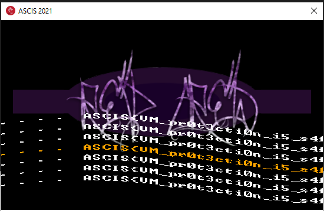

# UNLOCK 

## Description


## Static analysis

### Stage 1: create and control child process

Firstly, in `WinMain` function, the program check if `SVATTT_2021` mutex have been created, it will be go to this function (I rename it is `parent_process`). In `parent_process`, program call `WaitForDebugEvent` to wait debug exception from child process and handle it using `debug_exception_handler` function. 

```c
BOOL parent_process()
{
  atexit(sub_4086A0);
  CreateMutexA(0, 1, "SVATTT_2021");
  create_vm_context();
  memset(&StartupInfo, 0, sizeof(StartupInfo));
  StartupInfo.cb = 0x44;
  memset(&ProcessInformation, 0, sizeof(ProcessInformation));
  ModuleHandleA = GetModuleHandleA(0);
  GetModuleFileNameA(ModuleHandleA, Filename, 0x100u);
  sleep_app();
  CurrentProcessId = GetCurrentProcessId();
  unknown_libname_14(CurrentProcessId, CommandLine, 0xAu);
  if ( !CreateProcessA(Filename, CommandLine, 0, 0, 0, 2u, 0, 0, &StartupInfo, &ProcessInformation) )
    print_faild_start();
  memset(&DebugEvent, 0, sizeof(DebugEvent));
  while ( 1 )
  {
    result = WaitForDebugEvent(&DebugEvent, 0xFFFFFFFF);// capture debugged exception
    if ( !result )
      break;
    debug_exception_handler((int *)&DebugEvent);
    ContinueDebugEvent(DebugEvent.dwProcessId, DebugEvent.dwThreadId, 0x10002u);
  }
  return result;
}
```


I don't know this technique, but I see it the same `ptrace` technique in linux. Because one process spawn the other process, so that difficult to debug child process. 

### Stage 2: flow of child process

In child process, the program get input (password) and check it. In function check my password, have a little funny :))

```c
void *get_decrypt()
{
  char Src[32]; // [esp+0h] [ebp-24h] BYREF
  int i; // [esp+20h] [ebp-4h]

  memmove(Src, &enc1, 0x2Cu);
  for ( i = 0; i < 0x20; ++i )
    Src[i] = ~Src[i];
  memset(&enc2, 0, 0x2Cu);
  memmove(&enc2, Src, 0x2Cu);
  return &enc2;
}
```

You see, size of `Src` variable is `0x20`,  but when `memmove` data from `enc1` to `Src` is `0x2C` bytes. This action will be overwrite return address of this function (I missing it sometime and go to fake flow, sad~ =)))))

After `memmove`, return address of this function is `loc_403CA0`. 

```asm
.text:00403CA0                   loc_403CA0:                             ; DATA XREF: .data:00423160↓o
.text:00403CA0 83 C4 14                          add     esp, 14h
.text:00403CA3 8B EC                             mov     ebp, esp
.text:00403CA5 53                                push    ebx
.text:00403CA6 56                                push    esi
.text:00403CA7 57                                push    edi
.text:00403CA8 68 D0 84 40 00                    push    offset sub_4084D0
.text:00403CAD FF 75 0C                          push    dword ptr [ebp+0Ch]
.text:00403CB0 68 D0 9D 40 00                    push    offset print_wrong
.text:00403CB5 68 D0 86 40 00                    push    offset decrypt_resource
.text:00403CBA FF 75 08                          push    dword ptr [ebp+8]
.text:00403CBD FF 75 10                          push    dword ptr [ebp+10h]
.text:00403CC0 CC                                int     3               ; Trap to Debugger
.text:00403CC1 DE                                db 0DEh ; Þ
.text:00403CC2 AD                                db 0ADh ; _
.text:00403CC3 C0                                db 0C0h ; À
.text:00403CC4 DE                                db 0DEh ; Þ
.text:00403CC5 68                                db  68h ; h
.text:00403CC6 01                                db    1
.text:00403CC7 50                                db  50h ; P
...
```

In `loc_403CA0`, after push some data in stack, the program stop with `0xcc` opcode and send debug event captured to parent process. And many data from `00403CC0` address is opcodes of VM. You can dump it to convert assembly.

### Stage 3: play with VM opcodes

When debug event is captured, the program will get all the context of thread, pass some checks `eip` and go to `VM_process`

```c
HMODULE __cdecl debug_exception_handler(int *a1)
{
// truncated...
  switch ( case_ )
  {
    case 1:
	// truncated...
      vm.ContextFlags = 0x1003F;
      GetThreadContext(hThread, &vm);
      result = (HMODULE)vm.Eip;
      if ( vm.Eip > dword_423C60 && vm.Eip < dword_423C60 + 0x90000 )
      {
        VM_process(&vm, dword_423C54);
        return (HMODULE)SetThreadContext(hThread, &vm);
      }
      break;
// truncated...
  }
  return result;
}
```

Program check if opcode matching phase2 (5 bytes after `cc` opcode)

```c
    if ( !memcmp(Buffer, &phase2, 5u) ) // phase2 = CC DE AD C0 DE
    {
      context->Eip += 4;
      lpBaseAddress_ = (LPCVOID)context->Eip;
      is_enable = 1;
      memset(vm.regs, 0, 0x430u);
      vm.regs->rsp_ = 0x100;
    }
    else if ( is_enable )
    {
      v32[1] = Buffer[0];
      switch ( Buffer[0] )
      {
        // truncated...
```

Have some many many opcodes is defined, something like that:

```c
      switch ( Buffer[0] )
      {
		// truncated...
        case 0x12u:
          GET_DATA_REG(Buffer[1], vm.regs);
          v16 = GET_DATA_REG(Buffer[2], vm.regs);
          v27 = GET_DATA_REG(Buffer[3], vm.regs);
          v32[0] = 0;
          ReadProcessMemory(a2[1], (LPCVOID)(v27 + v16), v32, 1u, &NumberOfBytesRead);
          POP_INS(Buffer[1], v32[0], &vm);
          context->Eip += 3;
          lpBaseAddress_ = (LPCVOID)context->Eip;
          break;
        case 0x13u:
          GET_DATA_REG(Buffer[1], vm.regs);
          v26 = GET_DATA_REG(Buffer[2], vm.regs);
          v25 = GET_DATA_REG(Buffer[3], vm.regs);
          v31 = 0;
          ReadProcessMemory(a2[1], (LPCVOID)(v25 + v26), &v31, 4u, &NumberOfBytesRead);
          POP_INS(Buffer[1], v31, &vm);
          context->Eip += 3;
          lpBaseAddress_ = (LPCVOID)context->Eip;
          break;
        case 0x20u:
          v38 = GET_DATA_REG(Buffer[1], vm.regs);
          v24 = GET_DATA_REG(Buffer[2], vm.regs);
          v38 ^= v24;
          if ( v38 )
            v4 = vm.regs->flags & 0xFE;
          else
            v4 = LOBYTE(vm.regs->flags) | 1;
          LOBYTE(vm.regs->flags) = v4;
          LOBYTE(vm.regs->flags) &= ~2u;
          POP_INS(Buffer[1], v38, &vm);
          context->Eip += 2;
          lpBaseAddress_ = (LPCVOID)context->Eip;
          break;
// truncated...
```

I make a little script to convert from binary to assembly, it is [script](files/parse_ins.py)

And this is the asm code:

```asm
0x0:	POP R1
0x2:	MOV [--ADDR], R1
0x4:	POP R1
;;truncated...
0x14:	POP R1
0x16:	MOV [--ADDR], R1
0x18:	MOV R4, [ADDR+1]
0x1b:	XOR R1, R1 ; =0 -> flags=1; #0 -> flags=0
0x1e:	XOR R2, R2 ; =0 -> flags=1; #0 -> flags=0
0x21:	XOR R3, R3 ; =0 -> flags=1; #0 -> flags=0
0x24:	XOR R6, R6 ; =0 -> flags=1; #0 -> flags=0
0x27:	MOV R2, 0
0x2a:	MOV R1, BYTE PTR [R4 + R2]
0x2e:	MOV R3, 67
0x31:	XOR R1, R3 ; =0 -> flags=1; #0 -> flags=0
0x34:	MOV R3, 231
0x37:	XOR R1, R3 ; =0 -> flags=1; #0 -> flags=0
0x3a:	MOV R3, 69
;; truncated...
0x136:	MOV R3, 228
0x139:	XOR R1, R3 ; =0 -> flags=1; #0 -> flags=0
0x13c:	MOV R5, 75
0x13f:	CMP R1, R5 ; equals=1, larger=0, lessthan=2
0x142:	JNZ 0x14a
0x144:	MOV R2, 1
0x147:	ADD R6, R2
;;...
```

The code get data from stack and stored on address. And input password is moved in `[R4 + ofs]` address with offset password. 

First byte of password `xor 67` , `xor 231`,... `== 75` many instructions (sub, xor, add) between.

Write a little [script](files/get_input.py) to find 15 first bytes of password is: `XCda7T7j29anVzF` and 19th password is: `4`

After each others bytes, `R6` will be increasing. In offset 15th, 4 bytes of password is store in `R1` and `xor [addr+5`]

```asm
0x3d3b:	ADD R6, R2
0x3d3e:	MOV R2, 15
0x3d41:	MOV R1, BYTE PTR [R4 + R2]
0x3d45:	MOV R2, 8
0x3d48:	SHL R1, R2
0x3d4b:	MOV R2, 16
0x3d4e:	MOV R3, BYTE PTR [R4 + R2]
0x3d52:	ADD R1, R3
0x3d55:	MOV R2, 8
0x3d58:	SHL R1, R2
0x3d5b:	MOV R2, 17
0x3d5e:	MOV R3, BYTE PTR [R4 + R2]
0x3d62:	ADD R1, R3
0x3d65:	MOV R2, 8
0x3d68:	SHL R1, R2
0x3d6b:	MOV R2, 18
0x3d6e:	MOV R3, BYTE PTR [R4 + R2]
0x3d72:	ADD R1, R3
0x3d75:	MOV R2, 0
0x3d78:	MOV R3, [ADDR+5]
0x3d7b:	XOR R1, R3 ; =0 -> flags=1; #0 -> flags=0
0x3d7e:	MOV R3, [ADDR+4]
0x3d81:	PUSH R3
0x3d83:	PUSH R1
0x3d85:	MOV R1, [ADDR+0]
0x3d88:	CALL R1
0x3d8a:	MOV R1, EAX
0x3d8c:	ADD R6, R1
```

After pop data in VM stack. I have:

```asm
; stack vm 
sub_4084D0 			; --> addr + 0
[ebp+0Ch]			; --> addr + 1
print_wrong			; --> addr + 2
decrypt_resource	; --> addr + 3
hWnd				; --> addr + 4
id_process			; --> addr + 5
```

From stack and asm, I can convert code in C like that:

```c
sub_4084D0(R1 ^ id_process, hWnd);
```

`id_process` is the global variable and have changed in function:

```c
DWORD change_argument()
{ // truncated...
  id_process += NtCurrentPeb()->BeingDebugged; // --> id_process = 5A4FA8DBh, BeingDebugged=1 
  String = GetCommandLineA();	// is id of parent process
  id_parent = _atoi64(String);			// 
  CurrentProcessId = GetCurrentProcessId();
  id_parent_2 = find_process(CurrentProcessId); // is id of parent process
  id_process ^= id_parent ^ id_parent_2 ^ 0x13371337; // id_parent ^ ip_parent_2 = 0
  return result;
}
```

`BeingDebugged=1`  because the current process is create by parent process (is debuggee). `GetCommandLineA` will retrieve the command-line string for the current process, that is command-line set when process is created by parent process. 

```c
  unknown_libname_14(CurrentProcessId, CommandLine, 0xAu);
  if ( !CreateProcessA(Filename, CommandLine, 0, 0, 0, 2u, 0, 0, &StartupInfo, &ProcessInformation) )
```

So that, `id_process = (0x5A4FA8DB +1) ^ 0x13371337`. In `sub_4084D0`:

```c
int __stdcall sub_4084D0(int a1, HWND hWnd)
{
  GetWindowTextA(hWnd, String, 0x100);
  if ( (*(_DWORD *)String ^ a1) == 0x5B248DD1 )
    return 4;
  else
    return 0;
}
```

Because `hWnd` is parent --> window text is `WindowName` --> string == `Protector`

Okay, In here, this is easy to find 4 bytes password at 15th is: `f3Dj`

Finally, the password found: `XCda7T7j29anVzFf3Dj4`

### Result

Flag is:



I think this is the very very fun challenge. I love it =)))

All idb file and my script [here](files/)