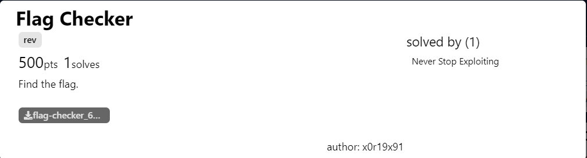
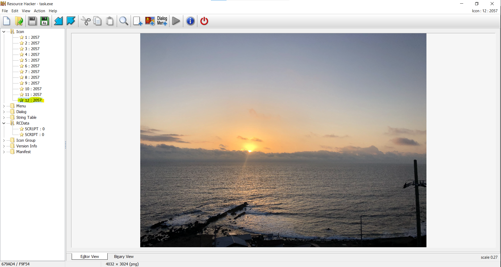
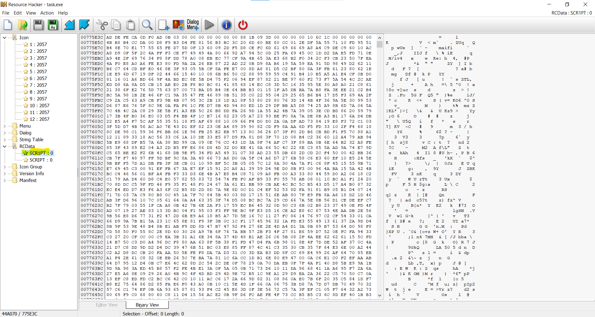
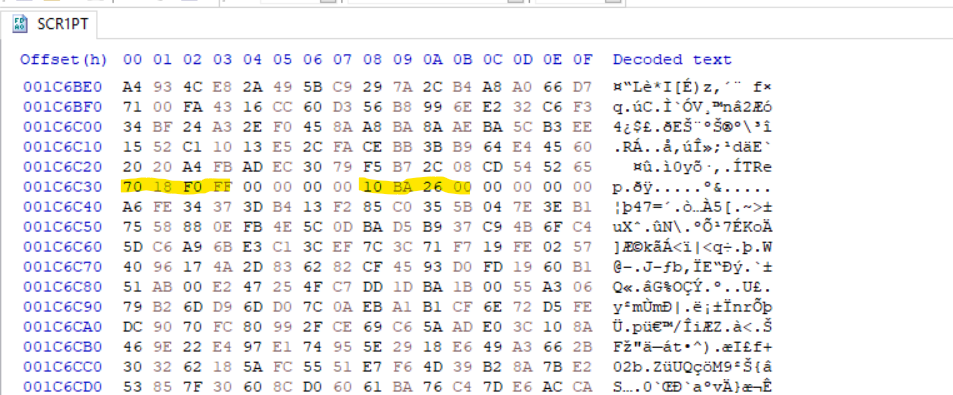

# Flag-Checker

*Cuối tuần trước, team mình có chơi giải zer0pts CTF. Cả giải mình và 1 bạn cùng team chỉ làm mỗi bài này, hơi buồn nhưng sau bài này mình đã học thêm được rất nhiều, cảm ơn tác giả vì chall gồm rất nhiều kiến thức*


## Miêu tả challenge



## Phân tích 

### Extract autoit script

Chall đưa cho mình một file `task.exe` có size `~13Mb`. Sau khi decompile, chúng mình có nhìn thấy string `autoit`

```c
// truncated...  
if ( IsDebuggerPresent() )
  {
    MessageBoxA(0i64, "This is a third-party compiled AutoIt script.", Caption, 0x10u);
    return sub_140008B2C(lpFile);
  }
```

 Đây là cơ chế anti debug của nhưng file được code bằng `autoit` và sau đó compile về `pe` file để run trên các hệ điều hành windows. 

Lúc đầu, chúng mình extract autoit script hơi cồng kềnh :<, sau giải mình mới biết có một cách khác nhanh hơn, vậy nên mình sẽ trình bày cả 2 cách trong bài writeup này luôn. 

#### Xài `Exe2Aut.exe`

Mọi người có thể tải file ở [link](http://domoticx.com/autoit3-decompiler-exe2aut/)

Nhưng tool đó chỉ support những file exe `32bit`, còn file challenge của mình `64bit`. Vậy nên chúng mình đã tìm cách đưa file 64bit về 32bit theo như cách làm ở blog [Decompiling compiled AutoIT scripts (64-bit)](https://www.hexacorn.com/blog/2015/01/08/decompiling-compiled-autoit-scripts-64-bit-take-two/)

Cơ bản là mình xài script của họ để đưa file 64bit về 32bit, sau đó dùng tool `Exe2Aut`

#### Tool UnAutoIt

Sau giải mình tìm được cách hay hơn để extract script autoit là dùng ngay tool của tác giả 

[UnAutoIt](https://github.com/x0r19x91/UnAutoIt) giúp extract được cả file 64bit và 32bit, xịnnnn :>

**Bên lề**

Ngoài script autoit mà chúng mình extract được thì trong file `task.exe` còn có 2 resources nữa khá nghi ngờ.

- 1 là Icon số 12 

- 2 là rescource có tên `SCR1PT` (cái `SCRIPT` còn lại là file autoit mà chúng mình extract đc bên trên) 

  :thinking: không biết để làm gì nhỉ?

---

### Rev `au_1` autoit script

Script autoit vừa extract được mình tạm gọi là script `au_1`. Khi đọc qua file `au_1`, mình thấy có một đoạn chương trình chạy một file `anime.exe` trong thư mục `temp`

```c
Func getanimelist()
    Local $path = @TempDir & "\\anime.exe"
    FileDelete($path)
    FileInstall("anime.exe", $path)
    $g_pid = Run($path, '', @SW_HIDE)
EndFunc    ; -> getanimelist
```

 Múc ra để rev thôi :))

Bên cạnh đó, file `au_1` còn tạo pipe để trao đổi data với file `anime.exe`

```c
Func getufoname()
    Return "\\\\.\\pipe\\anime"
EndFunc    ; -> getufoname

```

Chương trình `au_1`  bắt đầu với hàm `hahahahahahahahahahahahaahahahahh()`, nhận input từ `inputbox`  sau đó gọi đến hàm `runtime_gogogogo()`.

```c
Func hahahahahahahahahahahahaahahahahh()
    Local $ret = $funcptr($MB_YESNO, $title, "Do you want to proceed?")
    If $ret = $IDNO Then
        $runtime_lockosthread("https://www.youtube.com/watch?v=dQw4w9WgXcQ")
        Exit
    EndIf
    Local $iron_man = InputBox($title, "Please enter the flag", "hahaha")
    If @error = 0x1 Then
        $runtime_lockosthread("https://www.youtube.com/watch?v=dQw4w9WgXcQ")
        Exit
    EndIf
    If runtime_gogogogo($iron_man) = 0x0 Then
        $funcptr(0x40, $title, "Well done. You got the flag!")
    Else
        $funcptr($MB_ICONQUESTION, $title, "Oops. try again!")
    EndIf
EndFunc    ; -> hahahahahahahahahahahahaahahahahh

Func runtime_gogogogo($text)
    Local $magic = StringToASCIIArray($text)
    modarr($magic)
    getanimelist()
    Local $this_is_a_variable = playsomeanime($magic)
    Return $this_is_a_variable
EndFunc    ; -> runtime_gogogogo
```

 Trong hàm `modarr` mình thấy chương trình có kiểm tra độ dài của input, nếu `=0x6e` thì sẽ return luôn còn chưa bằng sẽ padding thêm một đoạn `random` :thinking: (có khi nào  0x6e là length của flag không ta). 

```c

Func modarr(ByRef $arr)
    If UBound($arr) = 0x6e Then
        Return
    Else
        _ArrayAdd($arr, Random(0x0, 0xff))
        modarr($arr)
    EndIf
EndFunc    ; -> modarr


```

Sau đó chương trình đi đến hàm `playsomeanime()`. Chương trình `reverse` sau đó `pop` ra từng ký tự của flag => lấy các ký tự từ cuối lên đầu và đưa vào `getanimedescription`. Nếu tất cả giá trị trả về `=0` thì có nghĩ là flag mà chúng ta truyền vào là đúng.

```c
Func playsomeanime($anime_title)
    If UBound($anime_title) = 0x0 Then
        Return 0x0
    EndIf
    _ArrayReverse($anime_title)
    Local $anime_desc = getanimedescription(_ArrayPop($anime_title))
    _ArrayReverse($anime_title)
    Return $anime_desc + playsomeanime($anime_title)
EndFunc    ; -> playsomeanime
```

Trong hàm `getanimedescription`, chương trình tạo từng struct và truyền giá trị cho từng trường rồi đưa vào hàm `findbestanimefrommyanimelist`. Ví dụ như một phần code của hàm `getanimedescription` ở dưới, chương trình tạo một struct có 2 trường là `int;int`, giá trị truyền vào cho trường số 1 là `1`, giá trị truyền vào cho trường số 2 là `$anime_title` (cũng chính là 1 byte của flag). Sau đó, hàm `findbestanimefrommyanimelist` nhận struct vừa tạo và truyền qua `pipe` đến cho chương trình `anime` để xử lý và nhận kết quả trả về. 

```c
Func getanimedescription($anime_title)
    Local $what_is_this_i_dont_know = "int;int"
    Local $unidentified_flying_object = $runtime_systemstack($what_is_this_i_dont_know)
    $runtime_morestack($unidentified_flying_object, 0x1, 0x1)
    $runtime_morestack($unidentified_flying_object, 0x2, $anime_title)
    Local $resp = findbestanimefrommyanimelist($runtime_getg($unidentified_flying_object), $runtime_funcsize($unidentified_flying_object))
    $runtime_morestack($unidentified_flying_object, 0x1, 0x3)
    // truncated...
EndFunc    ; -> getanimedescription

Func findbestanimefrommyanimelist($haha_null_ptr, $this_is_null)
    Local $idatalostintonulldevice, $inullptr
    Local $ufo = $runtime_systemstack("align 1;byte[4096]")
    $null_far_ptr = $runtime_getg($ufo)
    Local $this_is_dev_null_in_windows
    Do
        $this_is_dev_null_in_windows = _WinAPI_CreateFile(getufoname(), 0x2, 0x6)
    Until $this_is_dev_null_in_windows > 0x0
    _NamedPipes_SetNamedPipeHandleState($this_is_dev_null_in_windows, 0x1, 0x0, 0x0, 0x0)
    _WinAPI_WriteFile($this_is_dev_null_in_windows, $haha_null_ptr, $this_is_null, $inullptr, 0x0)
    _WinAPI_ReadFile($this_is_dev_null_in_windows, $null_far_ptr, 0x1000, $idatalostintonulldevice, 0x0)
    $runtime_free($this_is_dev_null_in_windows)
    Return $ufo
EndFunc    ; -> findbestanimefrommyanimelist

Func getufoname()
    Return "\\\\.\\pipe\\anime"
EndFunc    ; -> getufoname
    
```

Đó là tất cả những việc cơ bản mà file `au_1` thực hiện, bây giờ chúng ta cần tìm hiểu chương trình `anime` sẽ xử lý như thế nào những data được truyền từ `au_1`

---

### Rev `anime.exe`

File `anime.exe` gần như bị strip hoàn toàn, vậy nên việc `rev` cũng hơi khó khăn. Và để hiểu hơn về chương trình xử lý như thế nào, chúng mình sẽ tìm cách debug. Vì chương trình `task.exe` là autoit nên nó sẽ mang thêm cơ chế antidebug của AutoIt, và nếu để chương trình `task.exe` chạy sau đó attach vào thì mình cũng khó để debug được file `anime.exe` (vì chương trình tạo pipe để trao đổi, nếu pipe với cùng tên đã được tạo rồi thì khi chúng ta chạy file `anime` khác sẽ khiến cho hàm `pipe` trả về `error`, với trong quá trình chạy, file AutoIt có lấy resource của chính nó, nếu chúng ta build riêng script AutoIt `au_1` thì khả năng chương trình sẽ không đi theo flow chính). Vậy nên, để debug đc chọn vẹn file `anime`, chúng mình đã làm như sau: 

- Chạy file `task.exe` đầu tiên, trong khi chương trình đợi `yes` từ người dùng, chúng ta sẽ dùng `x64dbg` để attach vào chương trình `task` => bypass antidebug của AutoIt
- Khi đã attach được vào `task`, đặt breakpoint ở đầu hàm `CreateProcess` or `CreateProcessW`. Sau khi chương trình chạy tiếp, đến đoạn `CreateProcess` chương trình `anime` ,  chúng ta `f8` để bắt đầu chạy `anime` nhưng `task` sẽ chưa gửi bất kỳ data gì qua `pipe` cho `anime`. Ngay sau đó, chúng mình mở IDA lên và attach vào `anime` => debug được file `anime` và chương trình vẫn đi theo flow chuẩn. 

#### Hàm sử lý chính

Quay lại một chút với script `au_1`, mỗi một struct mà nó tạo sẽ thì trường số 1 sẽ chính là `id`, tương ứng với mỗi `id` mà dữ liệu gửi lên, chương trình `anime` sẽ đưa vào các hàm xử lý khác nhau như phần code bên dưới:

```cpp
void main_process()
{
// truncated...
  id_0 = 0;
  handle_func(v10, &id_0, fn_DEAD);
  v9 = v11;
  id_1 = 1;
  handle_func(v11, &id_1, fn_CODE);
  v9 = v12;
  id_2 = 2;
  handle_func(v12, &id_2, FN_12345678);
  v9 = v13;
  id_3 = 3;
  handle_func(v13, &id_3, fn_BADFOOD);
  v9 = v14;
  id_4 = 4;
  handle_func(v14, &id_4, fn_CAFEBABE);
  v9 = v15;
  id_5 = 5;
  handle_func(v15, &id_5, fn_RET2);
  v9 = v16;
  id_6 = 6;
  handle_func(v16, &id_6, fn_unknown);
  v9 = v17;
  id_7 = 7;
  handle_func(v17, &id_7, fn_PNG_resource);
// truncated...
}
```

*Trong file `anime` có sử dụng một technique gọi các hàm qua hash, mình có sử dụng một plugin tên là [hashdb](https://github.com/OALabs/hashdb-ida) để lookup giúp quá trình reverse static đơn giản hơn, nhưng vẫn trầm cảm vler :<*

#### Đi theo flow của data

**ID=1**

Bắt đầu, struct gửi từ script `au_1` đến file `anime`

```cpp
    Local $what_is_this_i_dont_know = "int;int"
    Local $unidentified_flying_object = $runtime_systemstack($what_is_this_i_dont_know)
    $runtime_morestack($unidentified_flying_object, 0x1, 0x1)
    $runtime_morestack($unidentified_flying_object, 0x2, $anime_title)
    Local $resp = findbestanimefrommyanimelist($runtime_getg($unidentified_flying_object), $runtime_funcsize($unidentified_flying_object))
```

Miêu tả

```cpp
struct ID_01 {
	int id=1;
	int byte_check=int(byte_flag);
}
```

Đây là đoạn code xử lý với `id=1` trong chương trình `anime` 

```cpp
__int64 __fastcall fn_CODE(__int64 a1)
{
  sub_140004A60(&unk_14007DF40, a1);
  *(a1 - 4) = 0xC0DE;
  return 4i64;
}
```

...

---

**ID=3**

Tiếp theo truyền một struct số 2 là:

```cpp
    $runtime_morestack($unidentified_flying_object, 0x1, 0x3)
    Local $gobinary = -1042320
    $runtime_morestack($unidentified_flying_object, 0x2, $gobinary)
    $resp = findbestanimefrommyanimelist($runtime_getg($unidentified_flying_object), $runtime_funcsize($unidentified_flying_object))
```

```cpp
struct ID_03 {
	int id=3;
    int sign_maybe=0xfff01870;
}
```

Map với data trong `resource` như hình dưới, mình thấy giá trị `0xfff01870` giống như `signature` nơi bắt đầu data, và giá trị bôi vàng bên cạnh `0x0026ba10` giống như là `size` của data.



Hàm sử lý `id=3` là hàm `fn_BADFOOD`

```CPP
void main_process()
{
// truncated...
  id_3 = 3;
  handle_func(v13, &id_3, fn_BADFOOD);
// truncated...
}
```

Trong hàm `fn_BADFOOD` có gọi đến hàm `fn_focus`

```cpp
__int64 __fastcall fn_BADFOOD(int *a1)
{
// truncated...
  fn_focus(v5, sign_FFF01870);
  *(v7 - 1) = 0xBADF00D;
// truncated...
  return 28i64;
}
```

Trong  hàm `fn_focus`, như đoạn code bên dưới:

```cpp
__int64 __fastcall fn_focus(__int64 a1, int sign_FFF01870_)
{
// truncated...
  OpenProcess = calc_hash_lookup_api(-1084555921, -270362688);
  v34 = (OpenProcess)(1040i64, 0i64, qword_14007DEF0);
  if ( v34 )
  {
    memset(Dst, 0, 0x30ui64);
    NtQueryInformationProcess = calc_hash_lookup_api(-1908709007, -1324361671);
    NtQueryInformationProcess(v34, 0i64, Dst, 48i64, v35);
    idx = 0i64;
    ReadProcessMemory = calc_hash_lookup_api(-1084555921, 1469914089);
    ReadProcessMemory(v34, *&Dst[8] + 16i64, &idx, 8i64, 0i64);
    v29 = j_HeapAlloc(0x1000, v5, v6);
    buf = 0i64;
    v27 = 0i64;
    v26 = 0;
    while ( 1 )
    {
      v13 = 0;
      if ( !v27 )
      {
        ReadProcessMemory_1 = calc_hash_lookup_api(0xBF5AFD6F, 0x579D1BE9);
        v13 = ReadProcessMemory_1(v34, buf + idx, v29, 4096i64, v35) != 0;
      }
      if ( !v13 )
        break;
      badfood = 0xBADF00DCAFEDEADi64;	// <-- start signature
      for ( i = 0i64; i < 0xFF8; ++i )
      {
        cnt = 0i64;
        for ( j = 0i64; j < 8; ++j )
          cnt += *(&badfood + j) == v29[j + i];
        if ( cnt == 8 )
        {
          v27 = i + buf + idx;
          break;
        }
      }
      buf += 4096i64;
    }
    j_Free(v29);
    v21 = 0i64;
    v20 = 0i64;
    if ( v27 )
    {
      v19 = 0i64;
      ReadProcessMemory_2 = calc_hash_lookup_api(-1084555921, 1469914089);
      ReadProcessMemory_2(v34, v27 + 8, &v19, 8i64, v35);
      v27 += 16i64;
      for ( k = 0i64; k < v19; ++k )
      {
        ReadProcessMemory_3 = calc_hash_lookup_api(-1084555921, 1469914089);
        ReadProcessMemory_3(v34, v27, &v17, 16i64, v35);
        v27 += 16i64;
        if ( sign_FFF01870 == v17 ) // <-- check end signature here
        {
          v20 = v18;
          v21 = v27;
          break;
        }
        if ( (v18 & 7) != 0 )
          v12 = 8 - (v18 & 7);
        else
          v12 = 0;
        v27 += v12;
        v27 += v18;
      }
    }
    CloseHandle = calc_hash_lookup_api(-1084555921, 268277755);
    CloseHandle(v34);
    nothing(a1, &v21, &v20);
  }
// truncated...
}
```

Đoạn code trên đọc data từ offset đầu tiên resource `SCR1PT` (bắt đầu là `0xBADF00DCAFEDEAD`) của file `task.exe`, mỗi lần đọc `4096` bytes, đọc đến khi 16 bytes cuối cùng có 4 bytes đầu là `0xFFF01870`.

Sau đó, script `au_1` sẽ nhận 8 bytes đầu là `signature`, 4 bytes tiếp theo là `sizeof_data` 

```cpp
    Local $signature_data = qwertyuiopasdfghjkl($resp, 0x8)
    Local $sizeof_data = qwertyuiopasdfghjkl($resp, 0x10, 0x4)
    Local $pid = qwertyuiopasdfghjkl($resp, 0x14, 0x4)
```

---

Struct data tiếp theo chương trình cũng làm như vậy:

```cpp
    $runtime_morestack($unidentified_flying_object, 0x1, 0x3)
    Local $eihowgtw = -1042320
    $runtime_morestack($unidentified_flying_object, 0x2, $eihowgtw)
    $resp = findbestanimefrommyanimelist($runtime_getg($unidentified_flying_object), $runtime_funcsize($unidentified_flying_object))
    Local $wlegowtuqepo = qwertyuiopasdfghjkl($resp, 0x8)
    Local $sizeof_data = qwertyuiopasdfghjkl($resp, 0x10, 0x4)
    Local $pid = qwertyuiopasdfghjkl($resp, 0x14, 0x4)
```

---

**ID=4**

Tiếp đến, chương trình có gửi một data với `id=4`

```cpp
    Local $t_pid_left = $runtime_panic($tprocess, "ProcessID")
    Local $t_tid_left = $runtime_panic($tprocess, "ThreadID")
	// truncated...
    Local $signature = qwertyuiopasdfghjkl($resp, 0x8)
    Local $ptr_sizeof_data = qwertyuiopasdfghjkl($resp, 0x10, 0x4)	    
	// truncated...
	$what_is_this_i_dont_know = "int;int;int;align 8;ptr;int;int;int;int"
    $unidentified_flying_object = $runtime_systemstack($what_is_this_i_dont_know)
    $runtime_morestack($unidentified_flying_object, 0x1, 0x4)
    $runtime_morestack($unidentified_flying_object, 0x2, $t_pid_left)
    $runtime_morestack($unidentified_flying_object, 0x3, $t_tid_left)
    $runtime_morestack($unidentified_flying_object, 0x4, $signature)
    $runtime_morestack($unidentified_flying_object, 0x5, $ptr_sizeof_data)
    $runtime_morestack($unidentified_flying_object, 0x6, 0x2 * 0x0 + 0x0)
    $runtime_morestack($unidentified_flying_object, 0x7, _WinAPI_GetCurrentProcessID())
    $runtime_morestack($unidentified_flying_object, 0x8, _WinAPI_GetCurrentThreadId())
    Local $resp = findbestanimefrommyanimelist($runtime_getg($unidentified_flying_object), $runtime_funcsize($unidentified_flying_object))
```

Struct mà `au_1` tạo ra sẽ như sau:

```cpp
struct ID_04 {
	int id=4;
    int pid=xx;	// processID that will be injected gofile
    int tid=xx;
    long signature=0xFFF01870;
    int sizeof_data=0x0026ba10;
    int unk_1=0;
    int hCurrentProcessID=_WinAPI_GetCurrentProcessID();
    int hCurrentThreadId=_WinAPI_GetCurrentThreadId();
}
```

Sau đó chuyển qua `pipe` đến cho hàm trong `anime` xử lý:

```cpp
void main_process()
{
// truncated...
  id_4 = 4;
  handle_func(v14, &id_4, fn_CAFEBABE);
// truncated...
}
```

Hàm xử lý là `fn_CAFEBABE` [=)) mấy tên tạo bằng hex hay ghê]

```cpp
__int64 __fastcall fn_CAFEBABE(int *a1)
{
// truncated...
  fn_magic(*v6, qword_14007DEF0, &v2, v4);
  *(v7 - 1) = 0xCAFEBABE;
// truncated...
  return 8i64;
}
```

Đi tiếp đến hàm `fn_magic`

```cpp
_QWORD *__fastcall fn_magic(__int64 a1, __int64 a2, __int128 *a3, int a4)
{
// truncated...
  OpenProc = calc_hash_lookup_api(-1084555921, 0xEFE297C0);
  result = (OpenProc)(0x1FFFFFi64, 0i64, LODWORD(v30[0]));
  v27 = result;
  if ( result )
  {
    OpenProcess = calc_hash_lookup_api(-1084555921, 0xEFE297C0);
    v26 = (OpenProcess)(0x1FFFFFi64, 0i64, v29);
    if ( v26 )
    {
      Openthred = calc_hash_lookup_api(-1084555921, 0x58C91E6F);
      v25 = (Openthred)(0x1FFFFFi64, 0i64, HIDWORD(v30[0]));
      if ( v25 )
      {
        v23 = *a3;
        decrypt_data(v24, v26, &v23);
        v22 = inject_gofile_to_process(v27, v25, v26, v24);
        sub_140003DF0(v21);
        sub_140004610(v21, v24);
        sub_140003E50(v21);
        v19 = v30[0];
        v20 = sub_140002560(v30[0]);
        if ( v20 != -1 )
        {
          v18 = *sub_140004680(&unk_14007DF40);
          v18 >>= v20 - 1;
          v18 &= 1u;
          v17 = (2 * (v28 & 0x7E)) | (2 * v18) | v28 & 1;
          v17 |= 8 * (v20 >= 9);
          v12 = operator new(0x20ui64);
          v15 = v30[0];
          sub_1400046B0(v12, v30[0]);
          v16 = v12;
          v12[6] = v17 & 1;
          *(v16 + 24) |= (v17 >> 1) & 2;
          sub_1400046E0(&unk_14007DEF8, v14, v30, &v16);
          NtWriteVirtualMemory = calc_hash_lookup_api(-1908709007, -988771134);
          (NtWriteVirtualMemory)(v27, v22 + 2, &v17, 1i64, 0i64);
// truncated...
  return result;
}
```

Chương trình strip nhiều, quá là mệt mỏi :pensive: 

Hàm này chúng mình đọc loanh quanh 1 tí xong thì debug, nhận thấy rằng, chắc là hàm quan trọng chỉ là hàm `decrypt_data` kia thôi, vì data truyền vào chính là data được đọc ra từ resource trên. Vậy nên mình sẽ đi vào hàm này, nhưng đáng buồn thay, hàm này có stack fame quá lớn, vậy nên không thể `f5` được nữa :tired_face:. Chúng ta phải quay lại với giá trị cốt lõi của `rev` thôi, đó là đọc `asm` =)))

```asm
.text:0000000140002F60 decrypt_data    proc near               ; CODE XREF: fn_magic+F7↓p
;; truncated...
;; 									move "abO4oHxrfR03YwaX4KuEFUoV"
.text:0000000140002F98                 movups  xmm0, xmmword ptr cs:aAbo4ohxrfr03yw+9 ; "R03YwaX4KuEFUoV"
.text:0000000140002F9F                 movups  xmmword ptr [rbp+0C0h+Str+9], xmm0
.text:0000000140002FA6                 movaps  xmm0, xmmword ptr cs:aAbo4ohxrfr03yw ; "abO4oHxrfR03YwaX4KuEFUoV"
.text:0000000140002FAD                 movaps  xmmword ptr [rbp+0C0h+Str], xmm0
;;					 Create AcquireContextW
.text:0000000140002FC9                 mov     dword ptr [rcx+20h], 0F0000000h
.text:0000000140002FD0                 lea     r8, aMicrosoftEnhan ; "Microsoft Enhanced RSA and AES Cryptogr"...
.text:0000000140002FD7                 xor     ecx, ecx
.text:0000000140002FD9                 mov     [rbp+0C0h+var_A4], ecx
.text:0000000140002FDC                 mov     edx, ecx
.text:0000000140002FDE                 mov     [rbp+0C0h+var_C0], rdx
.text:0000000140002FE2                 lea     rcx, [rbp+0C0h+var_48]
.text:0000000140002FE6                 mov     r9d, 18h
.text:0000000140002FEC                 call    rax             ; CryptAcquireContextW
;; 					CryptCreateHash with Alg=0x800C => SHA256
.text:0000000140002FFB                 mov     r8, [rbp+0C0h+var_C0]
.text:0000000140002FFF                 mov     r9d, [rbp+0C0h+var_A4]
.text:0000000140003003                 mov     rcx, [rbp+0C0h+var_48]
.text:0000000140003007                 mov     rdx, rsp
.text:000000014000300A                 lea     r10, [rbp+0C0h+var_50]
.text:000000014000300E                 mov     [rdx+20h], r10
.text:0000000140003012                 mov     edx, 800Ch
.text:0000000140003017                 call    rax             ; CryptCreateHash
;; 					CryptHashData "abO4oHxrfR03YwaX4KuEFUoV" --> SHA256
.text:0000000140003026                 mov     [rbp+0C0h+CryptHashData], rax
.text:000000014000302A                 lea     rcx, [rbp+0C0h+Str] ; Str
.text:0000000140003031                 mov     [rbp+0C0h+var_B8], rcx
.text:0000000140003035                 call    strlen
.text:000000014000303A                 mov     rdx, [rbp+0C0h+var_B8]
.text:000000014000303E                 mov     r9d, [rbp+0C0h+var_A4]
.text:0000000140003042                 mov     rcx, rax
.text:0000000140003045                 mov     rax, [rbp+0C0h+CryptHashData]
.text:0000000140003049                 mov     r8d, ecx
.text:000000014000304C                 mov     rcx, [rbp+0C0h+var_50]
.text:0000000140003050                 call    rax				; CryptHashData
;; 					CryptDerivedKey với Alg=0x660E --> AES128
.text:000000014000305F                 mov     r9d, [rbp+0C0h+var_A4]
.text:0000000140003063                 mov     r8, [rbp+0C0h+var_50]
.text:0000000140003067                 mov     rcx, [rbp+0C0h+var_48]
.text:000000014000306B                 mov     rdx, rsp
.text:000000014000306E                 lea     r10, [rbp+0C0h+var_58]
.text:0000000140003072                 mov     [rdx+20h], r10
.text:0000000140003076                 mov     edx, 660Eh
.text:000000014000307B                 call    rax             ; CryptDerivedKey
;; truncated...
```

Sau đoạn `asm` trên ta có thể thấy được hàm decrypt data từ resource là `AES128` ở mode `CBC` (mode mặc định của API windows) với `key` là 16 bytes đầu của `SHA256("abO4oHxrfR03YwaX4KuEFUoV")`, `iv` sẽ là 16 bytes `\x00`.

**Lạc trôi**

Chúng mình thử decrypt từ resource thì nhận được 3 files

- 1 là file golang
- 1 là script AutoIt mình gọi là script `au_2` 
- 1 là file exe 

Chúng mình có xem qua cả 3 files, và ngạc nhiên khi đọc `au_2` vì có đoạn:

```cpp
Func compute()
    Local $msg = ''
    For $i = 0x0 To 0x28 Step + 0x1
        Sleep(0x2710)
        $msg = $msg & Chr(getchar($i))
    Next
    Return $msg
EndFunc    ; -> compute

Func getchar($number)
    If $number <= 0x9 Then
        Return 0x30 + $number
    Else
        Local $sum = 0x0
        For $i = 0x1 To 0xa Step + 0x1
            $sum = BitAND($sum + getchar($number - $i), 0xff)
        Next
        Return $sum
    EndIf
EndFunc    ; -> getchar

MsgBox(0x40, "Flag Generator", "Computing flag....")
Sleep(0xc350)
Local $flag_text = "zeropts<"
Sleep(0xc350)
Local $flag = compute()
Sleep(0x186a0)
MsgBox(0x40, "Flag Generator", $flag_text & $flag & ">")
MsgBox(0x40, "Flag Generator", "Bye Bye...")
```

Mình đã nghĩ đến đây sẽ có được `flag`, nhưng đời không như mơ, nếu dễ thế này thì đã nhiều team làm được rồi =)))

*Đừng thấy hoa nở mà ngỡ xuân về*

Một file exe thì chỉ là run `cmd.exe` và khi debug chúng mình không thấy `anime` chạy file `cmd.exe` , vậy nên khả năng cao file exe mình decrypt được cũng chỉ là một file lừa :shit:

**Cách `go` file đc inject vào các process**

Sau khi được decrypt, file golang được inject vào tất cả các process random trong những process sau: `["write.exe", "notepad.exe", "calc.exe", "werfault.exe", "cscript.exe"]`

Trong script `au_1`  ta thấy, có một đoạn chương trình sẽ chạy random một trong 5 file và lấy ra: hProcess, hThread, ProcessID, ThreadID. Sau đó truyền đến cho file `anime` xử lý.

```cpp
    Local $tprocess = $runtime_systemstack($TAGPROCESS_INFORMATION)
    Local $tstartup = $runtime_systemstack($TAGSTARTUPINFO)
    $runtime_newgoroutine('', "C:\\Windows\\System32\\" & getanimepath(), 0x0, 0x0, 0x0, 0x4, 0x0, 0x0, $tstartup, $tprocess)
    Local $h_pr_left = $runtime_panic($tprocess, "hProcess")
    Local $h_th_left = $runtime_panic($tprocess, "hThread")
    Local $t_pid_left = $runtime_panic($tprocess, "ProcessID")
    Local $t_tid_left = $runtime_panic($tprocess, "ThreadID")
        // truncated...
Func getanimepath()
    Local $anime_list[] = ["write.exe", "notepad.exe", "calc.exe", "werfault.exe", "cscript.exe"]
    Return $anime_list[Random(0x0, UBound($anime_list) + -1)]
EndFunc    ; -> getanimepath
```

Đoạn code xử lý inject trong file `anime`. Chương trình ghi data sau khi decrypt ra một file trong `temp` và lại được map vào một vùng trong process mới, ngay sau đó file trong `temp` cũng được xóa đi luôn.

```cpp
__int64 __fastcall inject_gofile_to_process(__int64 a1, __int64 a2, __int64 a3, __int64 a4)
{
// truncated...
  v24 = sub_7FF7B1AF4B90(a4);
  v23 = sub_7FF7B1AF4BB0(v29);
  v21 = write_temp_file(v24, v23); // <-- write data to temp file (format: TH*.tmp)
  if ( v21 )
  {
    if ( v21 != -1 )
    {
      v20 = 0;
      v19 = 0i64;
      v18 = 0i64;
      NtMapViewOfSection = calc_hash_lookup_api(-1908709007, -720004204);
      v20 = (NtMapViewOfSection)(v21, v26, &v18, 0i64, 0i64, 0i64, &v19, 1, 0, 2);
      if ( !v20 || v20 == 1073741827 )
      {
        v17[1] = v24;
        v17[0] = v18;
        v16 = *(v24 + 60) + v24;
        v15 = *(v16 + 40) + v18;
        memset(Dst, 0, 0x4D0ui64);
        v12 = 1048578;
        NtGetContextThread = calc_hash_lookup_api(-1908709007, -382344301);
        NtGetContextThread(v27, Dst);
        v13 = v15;
        NtSetContextThread = calc_hash_lookup_api(-1908709007, 1765139349);
        NtSetContextThread(v27, Dst);
        v10 = v14;
        v9 = v14 + 16;
        NtWriteVirtualMemory = calc_hash_lookup_api(-1908709007, -988771134);
        NtWriteVirtualMemory(v26, v9, v17, 8i64, v22);	// <-- Write from file to virtual memory in each process
        return v10;
      }
    }
  }
  return v25;
}
```

Mình nhận thấy chương trình chỉ `decrypt` và `inject` file golang. 

---

**ID=7**

Dưới đây là đoạn code tạo struct data để truyền cho `anime`

```cpp
    _NamedPipes_CreatePipe($eoigwowufbwfo, $hwritepipe)
    _NamedPipes_CreatePipe($hreadpipe, $asfgeonwog)
    $unidentified_flying_object = $runtime_systemstack("int;int;int")
    $runtime_morestack($unidentified_flying_object, 0x1, 0x7)
    $runtime_morestack($unidentified_flying_object, 0x2, $hreadpipe)
    $runtime_morestack($unidentified_flying_object, 0x3, $hwritepipe)
// truncated...
    $runtime_free($asfgeonwog)
    $runtime_free($eoigwowufbwfo)
    $resp = findbestanimefrommyanimelist($runtime_getg($unidentified_flying_object), $runtime_funcsize($unidentified_flying_object))
    $unidentified_flying_object = $runtime_systemstack("int;int", $runtime_getg($resp))
    Local $l1 = $runtime_panic($unidentified_flying_object, 0x2)
```

Struct được gửi đi sẽ như sau:

```cpp
struct ID_07 {
    int id=7;
    int hreadpipe=xx;
    int hwritepipe=xx;
}
```

Có thể thấy,  script `au_1` gửi đi 2 `pipe` một là `read` và một là `write` Mà trước đó, data được read từ resource:

```cpp
    Local $aa1 = _WinAPI_FindResource(0x0, 0x3, 0xc)
    Local $aa2 = _WinAPI_SizeOfResource(0x0, $aa1)
    Local $aa3 = _WinAPI_LoadResource(0x0, $aa1)
    Local $aa4 = _WinAPI_LockResource($aa3)
    Local $nullptr = $runtime_systemstack("ptr;int")
    $runtime_morestack($nullptr, 0x1, $aa4)
    $runtime_morestack($nullptr, 0x2, $aa2)
    Local $inullptr
    _WinAPI_WriteFile($asfgeonwog, $runtime_getg($nullptr), $runtime_funcsize($nullptr), $inullptr)
```

Hàm `_WinAPI_FindResource(0x0, 0x3, 0xc)` sẽ lấy resource thứ  12 (0xc) ở resourc `icon` (id=3)

```
RT_ICON
MAKEINTRESOURCE(3)							Hardware-dependent icon resource.
```

Và struct truyền vào `pipe` mới này sẽ có dạng như sau:

```cpp
struct DATA_PIPE2 {
    char *ptr=xx; // pointer to start of icon12 resource
    int sizeof_rs=xx; // size of resource
}
```

Trong chương trình `anime`, hàm xử lý `id=7` là hàm `fn_resource`. Hàm này có nhận struct `DATA_PIPE2` từ pipe mới bên trên và đọc ra 2 giá trị `ptr_data` và `size_data`. Sau đó dùng hàm `ReadProcessMemory` để đọc toàn bộ data từ file `Icon12.png`

```cpp
void main_process()
{
// truncated...
  handle_func(v17, &id_7, fn_resource);
// truncated...
}
void __fastcall fn_resource(int *a1, __int64 a2)
{
// truncated...
  v38 = (OpenProcess)(0x450i64, 0i64, qword_14007DEF0);
  DuplicateHandle = calc_hash_lookup_api(0xBF5AFD6F, 0xBD566724);
  (DuplicateHandle)(v38, v40, -1i64, &v37, 0, 0, 2);
  DuplicateHandle_1 = calc_hash_lookup_api(-1084555921, 0xBD566724);
  (DuplicateHandle_1)(v38, v39, -1i64, v36, 0, 0, 2);
  ReadFile = calc_hash_lookup_api(-1084555921, 0x10FA6516);
  ReadFile(v37, &data, 16i64, &v33, 0i64); // <-- read struct DATA_PIPE2
  ptr_data = data;
  size_data = size_data;
  v30 = sub_14003C460(0i64);
  new_mem = j_HeapAlloc(v35_1, v2, v3);
  cnt = size_data;
  v27 = 0i64;
  while ( 1 )
  {
    v15 = 0;
    if ( cnt > 0 )
    {
      ReadProcessMemory = calc_hash_lookup_api(-1084555921, 1469914089);
      v15 = ReadProcessMemory(v38, v27 + ptr_data, &new_mem[v27], v28, &v33) != 0;
    }
    if ( !v15 )
      break;
    v27 += v33;
    cnt -= v33;
  }
// trucated...
}
```

Tiếp theo đó, chương trình sẽ xử lý những data trong file PNG qua các hàm:

```cpp

// truncated...
  v24 = j_HeapAlloc(v25, v4, v5);
  sub_37830(data_pipe, v24, v25, 4, 0); // <-- process PNG data
  sub_3D750(data_pipe);					// <-- process PNG data too
  sub_5CB0(v23, v6);
  v22 = 0i64;
  v21 = 1;
  while ( 1 )
  {
    v12 = 0;
    if ( v22 < sub_6100(v49) )
      v12 = qword_7EF68 < v25;
    if ( !v12 )
      break;
    if ( (sub_4A20(qword_7EF68 / 3ui64, qword_7EF68 % 3ui64) & 1) != 0 )
    {
      v11 = v24[qword_7EF68] % 2;
      ++v22;
      v21 = v11 == (*sub_6110(v49) ^ 0x30) && v21;
    }
    qword_7EF68 += 3i64;
  }
// truncated...
}
```


####  Rev golang file

Trong file golang, tại hàm `main_init_0`, chương trình sẽ lấy handle của 2 hàm:

```cpp
  main_g_func2_r = GetCurrentThreadId;
  main_g_func3_r = GetCurrentProcessId;
```

Tại `main_main`, chương trình chọn random một process, và sau đó tạo một struct gửi lại cho 

```cpp
```

