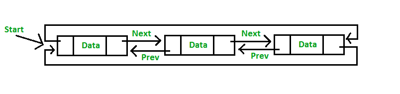
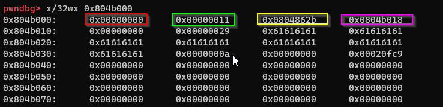

# Learning Heap Exploitation

## Ngâm cứu malloc.c 🤦‍♀️

### Các thuật toán sử dụng:

- for larger ( ≥ 512 bytes) → FIFO
- for small ( ≤ 64 bytes)  → `recycled chunks` tái sử dụng các chunk sau khi bị freed
- in between, kết hợp cả larger + small
- for very larger (≥ 128KB) → system memory mapping

### Debugging

`-DMALLOC_DEBUG` assertion khi mà memory errors → checking fairly extensive nhưng chậm hơn khi chạy

`MALLOC_DEBUG` check những non-mmapped allocated và free chunk

### malloc(size_t n)

      Trả về một con trỏ tới một chunk mới được allocated có size ít nhất là `n bytes` 

Nếu `n=0` , malloc sẽ trả về một chunk có size nhỏ nhất ( minimum size là `16 bytes` trong hầu hết os `32bit` và `24 hoặc 32 bytes` trong os `64bit`

### free(void* p)

Giải phóng một chunk được trỏ bởi `p` 

Nếu `p=NULL` thì không sao cả. 

## Note 🤷‍♀️

struct `malloc` 🍔🍕🌭

```c
/*
  This struct declaration is misleading (but accurate and necessary).
  It declares a "view" into memory allowing access to necessary
  fields at known offsets from a given base. See explanation below.
*/
struct malloc_chunk {

  INTERNAL_SIZE_T      mchunk_prev_size;  /* Size of previous chunk (if free).  */
  INTERNAL_SIZE_T      mchunk_size;       /* Size in bytes, including overhead. */

  struct malloc_chunk* fd;         /* double links -- used only if free. */
  struct malloc_chunk* bk;

  /* Only used for large blocks: pointer to next larger size.  */
  struct malloc_chunk* fd_nextsize; /* double links -- used only if free. */
  struct malloc_chunk* bk_nextsize;
}; 
```

- `INTERNAL_SIZE_T`  = `size_t`
- `mchunk_prev_size`  là size của previous chunk, được dùng khi chunk đó bị free hoặc được sử dụng lại
- `struct malloc* fd` forward pointer (in linked list)
- `struct malloc* bk` backward pointer

## Allocated chunk

```c
    chunk-> +-+-+-+-+-+-+-+-+-+-+-+-+-+-+-+-+-+-+-+-+-+-+-+-+-+-+-+-+-+-+-+-+
            |             Size of previous chunk, if unallocated (P clear)  |
            +-+-+-+-+-+-+-+-+-+-+-+-+-+-+-+-+-+-+-+-+-+-+-+-+-+-+-+-+-+-+-+-+
            |             Size of chunk, in bytes                     |A|M|P|
      mem-> +-+-+-+-+-+-+-+-+-+-+-+-+-+-+-+-+-+-+-+-+-+-+-+-+-+-+-+-+-+-+-+-+
            |             User data starts here...                          .
            .                                                               .
            .             (malloc_usable_size() bytes)                      .
            .                                                               |
nextchunk-> +-+-+-+-+-+-+-+-+-+-+-+-+-+-+-+-+-+-+-+-+-+-+-+-+-+-+-+-+-+-+-+-+
            |             (size of chunk, but used for application data)    |
            +-+-+-+-+-+-+-+-+-+-+-+-+-+-+-+-+-+-+-+-+-+-+-+-+-+-+-+-+-+-+-+-+
            |             Size of next chunk, in bytes                |A|0|1|
            +-+-+-+-+-+-+-+-+-+-+-+-+-+-+-+-+-+-+-+-+-+-+-+-+-+-+-+-+-+-+-+-+
```

`chunk` là phần bắt đầu của một chunk malloc, và `mem` là một con trỏ đến vùng data của người dùng (= số bytes mà người dùng muốn cấp phát)

```c
example:
char *ptr = (char *)malloc(8);
---------------------------------------
ptr = mem
bytes in mem = 8 bytes
```

`chunk` hay `mem` đều có size // 4

`size of chunk` = `size chunk` + `A|M|P` (3 bit cuối)

`A: NON_MAIN_ARENA` 0 nếu chunk in `main_arena`

`P: PRE_INUSE` Nếu là 0 thì trường `size of previous chunk` sẽ mang giá trị là size của chunk trước đó.

`M: IS_MMAPPED` (chưa hiểu cái này để làm gì, liên quan đến `mmap` gì đó)

## Free chunk

free chunk được lưu trong một `circular doubly-linked list`

### circular doubly-linked list



### Free chunk

```c
    chunk-> +-+-+-+-+-+-+-+-+-+-+-+-+-+-+-+-+-+-+-+-+-+-+-+-+-+-+-+-+-+-+-+-+
            |             Size of previous chunk, if unallocated (P clear)  |
            +-+-+-+-+-+-+-+-+-+-+-+-+-+-+-+-+-+-+-+-+-+-+-+-+-+-+-+-+-+-+-+-+
    `head:' |             Size of chunk, in bytes                     |A|0|P|
      mem-> +-+-+-+-+-+-+-+-+-+-+-+-+-+-+-+-+-+-+-+-+-+-+-+-+-+-+-+-+-+-+-+-+
            |             Forward pointer to next chunk in list             |
            +-+-+-+-+-+-+-+-+-+-+-+-+-+-+-+-+-+-+-+-+-+-+-+-+-+-+-+-+-+-+-+-+
            |             Back pointer to previous chunk in list            |
            +-+-+-+-+-+-+-+-+-+-+-+-+-+-+-+-+-+-+-+-+-+-+-+-+-+-+-+-+-+-+-+-+
            |             Unused space (may be 0 bytes long)                .
            .                                                               .
            .                                                               |
nextchunk-> +-+-+-+-+-+-+-+-+-+-+-+-+-+-+-+-+-+-+-+-+-+-+-+-+-+-+-+-+-+-+-+-+
    `foot:' |             Size of chunk, in bytes                           |
            +-+-+-+-+-+-+-+-+-+-+-+-+-+-+-+-+-+-+-+-+-+-+-+-+-+-+-+-+-+-+-+-+
            |             Size of next chunk, in bytes                |A|0|0|
            +-+-+-+-+-+-+-+-+-+-+-+-+-+-+-+-+-+-+-+-+-+-+-+-+-+-+-+-+-+-+-+-+
```

`foot` 

Example: [L***earning Heap***](https://sensepost.com/blog/2017/painless-intro-to-the-linux-userland-heap/) 

```c
+-------+   +-------+   +-------+
|CHUNK 1|   |CHUNK P|   |CHUNK 3|
+-------+   +-------+   +-------+   
|  FD   |-->|  FD   |-->|  FD   | ---------|
+-------+   +-------+   +-------+          |
|  BK   |<--|  BK   |<--|  BK   |          |
+-------+   +-------+   +-------+          v
```

```c
,----------.
,>+-------+ | +\-----/+ `>+-------+
| |CHUNK 1| | |C\UNK/P|   |CHUNK 3|
| +-------+ | +--\-/--+   +-------+   
| |  FD   |-´ |  FX  |   |  FD   |
| +-------+   +--/-\--+   +-------+   
| |  BK   |   | /BK \ | ,>|  BK   |
| +-------+   +/-----\+ | +-------+
 `----------------------
```

# Hacknote 🙇‍♀️

cơ chế allocated của malloc `line 1338` in [source malloc.c](https://code.woboq.org/userspace/glibc/malloc/malloc.c.html#1338)




# applestore

change addr `atoi` function


## SIGABRT


```jsx
abort() sends the calling process the SIGABRT signal,
this is how abort() basically works.

abort() is usually called by library functions which detect an internal error 
or some seriously broken constraint. For example malloc() will call abort() 
if its internal structures are damaged by a heap overflow.
```

### Documents

[Glibc Heap Exploitation Basics : Introduction to ptmalloc2 internals (Part 1)](http://blog.k3170makan.com/2018/11/glibc-heap-exploitation-basics.html)

[SensePost | Painless intro to the linux userland heap](https://sensepost.com/blog/2017/painless-intro-to-the-linux-userland-heap/)

[malloc.c source code [glibc/malloc/malloc.c] - Woboq Code Browser](https://code.woboq.org/userspace/glibc/malloc/malloc.c.html)

[A Memory Allocator](http://gee.cs.oswego.edu/dl/html/malloc.html)

[malloc_chunk](https://heap-exploitation.dhavalkapil.com/diving_into_glibc_heap/malloc_chunk)